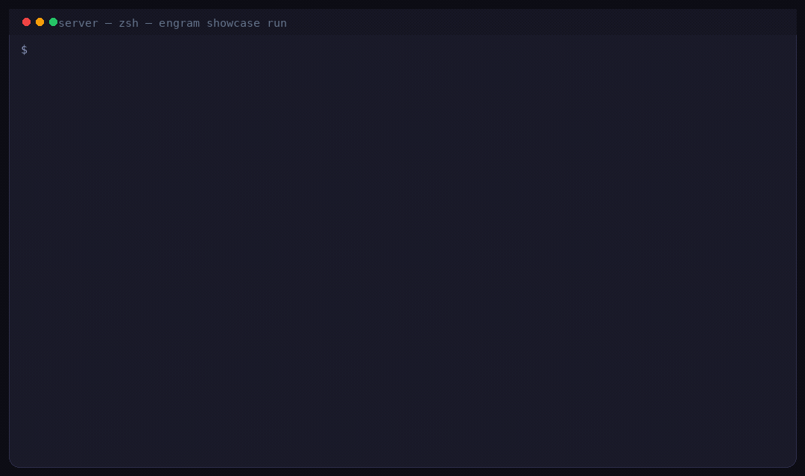

<p align="center">
  
</p>

<p align="center">
  <a href="https://engram-roan.vercel.app"><strong>Website</strong></a> &nbsp;·&nbsp;
  <a href="#quickstart">Quickstart</a> &nbsp;·&nbsp;
  <a href="#harness-flow">How It Works</a> &nbsp;·&nbsp;
  <a href="#connect-your-agent">Connect</a> &nbsp;·&nbsp;
  <a href="docs/REFERENCE.md">Full Reference</a> &nbsp;·&nbsp;
  <a href="#dashboard">Dashboard</a>
</p>

<p align="center">
  <a href="https://engram-roan.vercel.app"></a>
  
  
  
  
</p>

<br>

**Engram is fully-local, long-term episode memory for AI agents — and it provably works.** On the real 8.9k-episode dogfood brain, deep recall reaches the gold memory in **42/42** gate queries and the organic continuity gate passes live at **~440ms** ([evidence](docs/product/experiments/M2_6_rerun_2026-07-21.md)). Conversations are stored as episodes with deterministic cues, recalled through hybrid semantic search, and cleaned up by an offline cold-brain process. A capture→recall loop with echo-guarded usage learning ships conservatively behind flip gates. A temporal knowledge graph is available as a **research/depth tier** — validation-gated, not the headline (measured net-neutral for answer accuracy so far; its proven win is surfacing connected episodes).

<table>
<tr>
<td width="33%" valign="top">

### Harness captures
Session-start injection, auto-observe hooks, offline queue replay. Routine turns stay in the harness; no agent tokens spent on capture.

</td>
<td width="33%" valign="top">

### Agent recalls
`get_context` once per session, `recall` when cues match, `remember` for durable facts the harness should not infer on its own.

</td>
<td width="33%" valign="top">

### Brain consolidates
Triage, projection, 15-phase consolidation, dream associations. Runs as a separate cold-brain process on a schedule — not while you work.

</td>
</tr>
</table>

<br>

## Brain Loop

<p align="center">
  
</p>

| Stage | What happens |
|-------|----------------|
| **Capture** | `observe`, harness `auto:*`, or `remember`: fast store, optional cue trace |
| **Cue** | Deterministic latent memory; recall before full LLM extraction |
| **Project** | Entity resolution, embedding, graph write (background or immediate) |
| **Recall** | Compact memory packets from hybrid search instead of raw chat history |
| **Consolidate** | Merge, infer, prune, dream (offline) |

<br>

## Harness flow

<p align="center">
  
</p>

The harness handles capture and session injection. The agent spends tokens on recall and explicit `remember` calls. Consolidation runs out-of-band in a separate cold-brain process, not during your session.

| Tier | Trigger | Action | Budget |
|------|---------|--------|--------|
| **Hot** | Session start, project open | AXI home, bootstrap, session prime | &lt; 3s |
| **Warm** | Read tools, proper nouns | auto_recall lite, packet cache | &lt; 350ms |
| **Cold** | Identity query, deep prior work | `recall`, `get_context` | &lt; 2s |
| **Background** | Scheduled (~2h), off-battery | Cold-brain consolidation, separate process | async |

**Runtime split:** a **hot shell** (`engram serve`, role `shell`) serves the golden loop with no in-process consolidation. A separate **cold brain** (`engram brain run`, a LaunchAgent every ~2h) does the heavy consolidation — it briefly pauses the shell and skips on battery or when there is no actionable work. Consolidation does not run while you work.

<p align="center">
  
</p>

Identity-core entities are promoted to the semantic tier, which decays more slowly in scoring. Semantic memories and identity-core entities are pruned on longer horizons than fresh episodic entries.

<br>

## Quickstart

### One command

```bash
curl -sSL https://raw.githubusercontent.com/Moshik21/engram/main/scripts/install.sh | bash
```

Installs native Helix (recommended), runs `engramctl quickstart`, and verifies the runtime.

```bash
engramctl start
engramctl status
engramctl doctor
```

### Connect your agent

```bash
# MCP + priming (Cursor, Windsurf, Grok Build)
engramctl connect cursor --project "$PWD"

# Claude Code / Codex: read-only session injection
engramctl connect claude-code --project "$PWD" --axi

# Passive transcript capture (Claude AutoCapture hooks)
engramctl connect claude-code --project "$PWD" --capture-transcript

# Bootstrap project docs into memory (idempotent)
engramctl bootstrap "$PWD"
```

<details>
<summary><strong>Developer / source install</strong></summary>

```bash
git clone https://github.com/Moshik21/engram.git ~/engram
cd ~/engram/server && uv sync
uv run engram setup --mode helix
make mcp-native    # MCP with native HelixDB (no Docker)
```

Modes: **Helix native** (best quality, no Docker) · **Lite** (SQLite, zero infra) · **Helix HTTP** (Docker) · **Full** (FalkorDB + Redis, legacy)

See [docs/install/](docs/install/) and [docs/REFERENCE.md](docs/REFERENCE.md#storage-modes) for full install paths.

</details>

<br>

## Try Engram (showcase)

Replay a bundled lite demo brain with no API keys:

```bash
cd server && uv run engram showcase run
```

<p align="center">
  
</p>

Three scripted beats: Liam continuity ("He had a great game today"), a correction (soccer to baseball), and a cross-session `get_context` briefing. Runs copy the bundled `demo.db` to `~/.engram/showcase/demo-run.db` so the packaged brain stays pristine.

```bash
# Export static beats for the website theater
cd server && uv run engram showcase export --out ../website/public/showcase-export.json

# Reseed the bundled demo.db from source
cd server && uv run engram showcase seed
cd server && uv run python scripts/simulate.py --showcase-seed engram/data/demo.db
```

Regenerate the recording anytime:

```bash
cd server && uv run python ../scripts/record_showcase.py
```

Outputs `docs/assets/showcase/showcase-demo.mp4` and `.gif` (also copied to `website/public/` for the site).

Step through the same beats in the [website scenario theater](https://engram-roan.vercel.app/#try-it). It reads `website/public/showcase-export.json`.

<br>

## Connect Your Agent

| Client | MCP | Priming rules | AXI inject | Transcript capture |
|--------|-----|---------------|------------|-------------------|
| **Claude Code** | yes | - | default | `--capture-transcript` |
| **Codex** | - | - | default | future |
| **Cursor** | yes | yes | - | - |
| **Windsurf** | yes | yes | - | - |
| **Grok Build** | yes | yes | - | - |
| **OpenClaw** | yes | skill | - | - |

**Agent protocol (harness-first):**

1. `claim_authority`, then follow `required_tools_before_answer`
2. `get_context` once per session (or on project switch / adoption debt)
3. `recall` when people, projects, or prior work appear in the question
4. `remember` for preferences, corrections, identity, durable decisions
5. Skip per-turn `observe` when harness capture is active

Validate adoption:

```bash
engram adoption --authority claim.json --calls trace.jsonl --expect-harness-capture
```

Design doc: [docs/harness-memory-adoption-plan.md](docs/harness-memory-adoption-plan.md)

<br>

## Key Capabilities

| Capability | Summary |
|------------|---------|
| **Deep episode recall** | Hybrid vector + BM25 search with a circuit breaker; 42/42 gate reach on the real brain |
| **Usage-based recency/frequency** | Bounded tiebreaker `u = f·r'` over behavioral usage events, echo-guarded; ships gated (default off until organic usage yield exists) |
| **ACT-R hygiene** | Recency/frequency activation retained for forgetting, prune floors, and tier-aware decay — not as a ranking signal (refuted by measurement; see below) |
| **Temporal graph (depth tier)** | People, orgs, concepts, relationships with valid-from / valid-to; research tier, validation-gated |
| **15-phase consolidation** | Triage, merge, infer, dream, prune (offline cycle) |
| **Memory packets** | Compact recall output with provenance for the current turn |
| **Prospective memory** | `intend`: graph-embedded intentions triggered by related topics |
| **Atlas** | Multi-scale graph exploration from region clusters to neighborhoods |
| **3D dashboard** | Graph visualization, consolidation monitor, evaluation gates |
| **Topological immunity** | Prunes low-connectivity noise and weak edges |

**Evidence ledger (what is measured, not marketed):** deep recall 42/42 and organic continuity PASS at ~440ms on the real 8.9k-episode brain ([M2.6 rerun](docs/product/experiments/M2_6_rerun_2026-07-21.md)); usage-ranking flip armed but held until organic used-tier yield is nonzero ([M2.6 gate](docs/product/experiments/M2_6_real_corpus_gate.md)); activation-from-access-history as a ranker was measured and **refuted** (reach collapse 23→2/36 when populated), replaced by the bounded usage tiebreaker ([RF goal](docs/product/RECENCY_FREQUENCY_GOAL.md), [design](docs/product/experiments/RF_target_design.md)); graph channel's proven contribution is episode surfacing (oracle-surface 2→22/36), not answer-accuracy lift.

<br>

## MCP tools

The public MCP surface is frozen to a **9-tool golden loop** (`ENGRAM_MCP_SURFACE=public`, the default). Stdio or streamable HTTP.

| Tool | Purpose |
|------|---------|
| `observe` / `remember` | Capture (fast queue vs immediate extraction) |
| `recall` / `get_context` | Hybrid retrieval and durable-first briefing |
| `intend` | Prospective memory (topic-triggered intentions) |
| `forget` | Retract or correct a memory |
| `claim_authority` | Memory ownership and tool protocol for the turn |
| `bootstrap_project` | Ingest project docs on first run |
| `get_runtime_state` | Report brain readiness and adoption debt |

Operator and evaluation tools (consolidation triggers, artifact search, timeline, question routing, Loop Steward) live on the `operator` and `full` surfaces via `ENGRAM_MCP_SURFACE` — they are not part of the public agent loop. See [docs/GOLDEN_LOOP.md](docs/GOLDEN_LOOP.md).

Full tool list: [docs/REFERENCE.md#mcp-integration](docs/REFERENCE.md#mcp-integration)

<br>

## Storage Modes

| Mode | Backend | Docker | Best for |
|------|---------|--------|----------|
| **Helix native** | PyO3 in-process | None | Recommended (~97ms search, nDCG@10 0.448) |
| **Lite** | SQLite + FTS5 | None | Zero setup, demos |
| **Helix HTTP** | HelixDB container | 1 | Production multi-service |
| **Full** | FalkorDB + Redis | 2 | Legacy throughput |

HelixDB combines graph, HNSW vector search, and field-level BM25 in one engine (171 compiled HelixQL queries).

Details: [docs/install/helix.md](docs/install/helix.md) · [Benchmarks](docs/REFERENCE.md#benchmarks)

<br>

## Privacy & data

Everything runs and stays local by default.

- No API keys are required to operate. Embeddings are local (fastembed / nomic); extraction falls back through harness `remember` proposals → optional local Ollama → a deterministic narrow pipeline.
- The offline capture queue at `~/.engram/capture-queue.jsonl` holds **verbatim prompts** until they are replayed into the graph on the next session start.
- The graph store is **plaintext on disk**. An encryption config exists (`ENGRAM_ENCRYPTION__ENABLED`) but is **off by default**.
- The REST API binds `127.0.0.1` and is **unauthenticated** by default. Only pass `--host 0.0.0.0` if you understand the exposure.
- Use `engram backup create` for snapshots (and `engram backup verify` / `engram backup restore` to check and roll back).

<br>

## Dashboard

3D graph view plus Atlas, Timeline, Feed, Activation, Consolidation, Evaluate, and Knowledge chat.

```bash
cd dashboard && pnpm install && pnpm dev   # http://localhost:5173
```

With the full stack, the dashboard updates over WebSocket when episodes are stored.

<br>

## Documentation

| Doc | Contents |
|-----|----------|
| [**REFERENCE.md**](docs/REFERENCE.md) | Installation, architecture, MCP, API, benchmarks, config, dev, troubleshooting |
| [**harness-memory-adoption-plan.md**](docs/harness-memory-adoption-plan.md) | Harness-first adoption design |
| [**axi-interface-plan.md**](docs/axi-interface-plan.md) | AXI session-start injection |
| [**install/**](docs/install/) | Lite, Helix, Docker, OpenClaw guides |
| [**vision/**](docs/vision/) | Product narrative and science |

<br>

## Project Structure

```
server/engram/
  activation/       ACT-R engine, BFS, PPR
  consolidation/    15-phase engine + scheduler
  ingestion/        CQRS: store_episode / project_episode
  mcp/              9-tool golden loop + operator surface
  retrieval/        Hybrid search, packets, auto_recall
  storage/          Helix native, SQLite, FalkorDB

dashboard/src/      React 19 + Three.js brain + Zustand
```

<br>

## Development

```bash
cd server && uv run pytest -m "not requires_helix" -v   # Backend tests
cd server && uv run ruff check .                        # Lint
cd server && uv run engram mcp                          # MCP stdio
make up-native                                          # Full stack, native Helix
```

Full commands: [docs/REFERENCE.md#development](docs/REFERENCE.md#development)

<br>

## License

Engram is **Apache 2.0**. See [LICENSE](LICENSE).

**HelixDB note:** HTTP/gRPC transport (default Docker) has no license impact on Engram. **Native PyO3** links AGPL-3.0 in-process; review terms for proprietary network services. Lite and Full backends have no AGPL concerns.