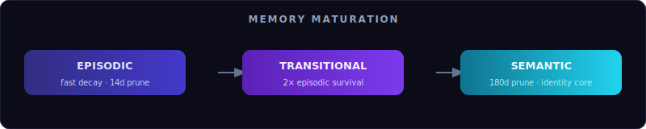

<p align="center">
  
</p>

<p align="center">
  <a href="https://engram-roan.vercel.app"><strong>Website</strong></a> &nbsp;·&nbsp;
  <a href="#quickstart">Quickstart</a> &nbsp;·&nbsp;
  <a href="#how-memory-compounds">How It Works</a> &nbsp;·&nbsp;
  <a href="#connect-your-agent">Connect</a> &nbsp;·&nbsp;
  <a href="docs/REFERENCE.md">Full Reference</a> &nbsp;·&nbsp;
  <a href="#dashboard">Dashboard</a>
</p>

<p align="center">
  <a href="https://engram-roan.vercel.app"></a>
  
  
  
  
</p>

<br>

**Engram gives AI agents memory that persists across sessions, organizes itself, and surfaces the right context when it matters.**

Conversations become **episodes**. Important people, facts, and relationships become a **temporal knowledge graph**. ACT-R activation ranks what’s relevant. Background consolidation merges duplicates, promotes stable memories, and fades noise — like sleep for a knowledge graph.

<table>
<tr>
<td width="33%" valign="top">

### Harness captures
Session-start injection, auto-observe hooks, offline queue replay. Routine turns are infrastructure — zero agent tokens.

</td>
<td width="33%" valign="top">

### Agent recalls
`get_context` once, `recall` when cues fire, `remember` for durable facts. Judgment, not habit.

</td>
<td width="33%" valign="top">

### Brain consolidates
Triage, projection, 16-phase consolidation, dream associations. Memory compounds while you work.

</td>
</tr>
</table>

<br>

## Brain Loop

<p align="center">
  
</p>

| Stage | What happens |
|-------|----------------|
| **Capture** | `observe`, harness `auto:*`, or `remember` — fast store, optional cue trace |
| **Cue** | Deterministic latent memory — recall before full LLM extraction |
| **Project** | Entity resolution, embedding, graph write (background or immediate) |
| **Recall** | Activation-aware packets — not a chat-log dump |
| **Consolidate** | Merge, infer, mature, prune, dream — offline graph hygiene |

<br>

## How Memory Compounds

<p align="center">
  
</p>

Engram separates **who captures** from **who judges**. The harness handles passive capture and session injection; the agent spends tokens only on recall and high-signal `remember`. The brain matures the graph in the background.

| Tier | Trigger | Action | Budget |
|------|---------|--------|--------|
| **Hot** | Session start, project open | AXI home, bootstrap, session prime | &lt; 3s |
| **Warm** | Read tools, proper nouns | auto_recall lite, packet cache | &lt; 350ms |
| **Cold** | Identity query, deep prior work | `recall`, `search_artifacts` | &lt; 2s |
| **Background** | Session end, schedule | triage, merge, dream | async |

<p align="center">
  
</p>

Entities graduate **episodic → transitional → semantic** as they mature. Semantic memories and identity-core entities survive pruning far longer than ephemeral episodic noise.

<br>

## Quickstart

### One command

```bash
curl -sSL https://raw.githubusercontent.com/Moshik21/engram/main/scripts/install.sh | bash
```

Installs native Helix (recommended), runs `engramctl quickstart`, and verifies the runtime.

```bash
engramctl start
engramctl status
engramctl doctor
```

### Connect your agent

```bash
# MCP + priming (Cursor, Windsurf, Grok Build)
engramctl connect cursor --project "$PWD"

# Claude Code / Codex — read-only session injection
engramctl connect claude-code --project "$PWD" --axi

# Passive transcript capture (Claude AutoCapture hooks)
engramctl connect claude-code --project "$PWD" --capture-transcript

# Bootstrap project docs into memory (idempotent)
engramctl bootstrap "$PWD"
```

<details>
<summary><strong>Developer / source install</strong></summary>

```bash
git clone https://github.com/Moshik21/engram.git ~/engram
cd ~/engram/server && uv sync
uv run engram setup --mode helix
make mcp-native    # MCP with native HelixDB (no Docker)
```

Modes: **Helix native** (best quality, no Docker) · **Lite** (SQLite, zero infra) · **Helix HTTP** (Docker) · **Full** (FalkorDB + Redis, legacy)

See [docs/install/](docs/install/) and [docs/REFERENCE.md](docs/REFERENCE.md#storage-modes) for full install paths.

</details>

<br>

## Connect Your Agent

| Client | MCP | Priming rules | AXI inject | Transcript capture |
|--------|-----|---------------|------------|-------------------|
| **Claude Code** | ✓ | — | default | `--capture-transcript` |
| **Codex** | — | — | default | future |
| **Cursor** | ✓ | ✓ | — | — |
| **Windsurf** | ✓ | ✓ | — | — |
| **Grok Build** | ✓ | ✓ | — | — |
| **OpenClaw** | ✓ | skill | — | — |

**Agent protocol (harness-first):**

1. `claim_authority` → follow `required_tools_before_answer`
2. `get_context` once per session (or on project switch / adoption debt)
3. `recall` when people, projects, or prior work appear
4. `remember` for preferences, corrections, identity, durable decisions
5. Do **not** `observe` every turn when harness capture is active

Validate adoption:

```bash
engram adoption --authority claim.json --calls trace.jsonl --expect-harness-capture
```

Design doc: [docs/harness-memory-adoption-plan.md](docs/harness-memory-adoption-plan.md)

<br>

## Key Capabilities

| | Capability | One line |
|---|------------|----------|
| 🧠 | **Temporal graph** | People, orgs, concepts, relationships — with valid-from / valid-to |
| ⚡ | **ACT-R activation** | Recency + frequency scoring; lazy recompute from access history |
| 🔗 | **Spreading activation** | Recall one entity → related nodes light up via graph proximity |
| 🌙 | **16-phase consolidation** | Triage, merge, infer, dream, prune — biological-memory inspired |
| 📦 | **Memory packets** | Compact, provenance-aware context shaped for the current turn |
| 🎯 | **Prospective memory** | `intend` — graph-embedded intentions that fire on related topics |
| 🗺️ | **Atlas** | Multi-scale graph exploration from region clusters to neighborhoods |
| 📊 | **3D dashboard** | Neural brain visualization, consolidation monitor, evaluation gates |
| 🔒 | **Topological immunity** | Dissolves low-gravity noise and hallucinated connections |
| 🧬 | **Auto-neuroplasticity** | Tunes 200+ activation parameters from retrieval ROI |

<br>

## MCP at a Glance

**27 tools** · **3 resources** · **2 prompts** — stdio or streamable HTTP.

| Tool | Purpose |
|------|---------|
| `observe` / `remember` | Capture (fast queue vs immediate extraction) |
| `recall` / `get_context` | Activation-aware retrieval and briefing |
| `bootstrap_project` | Ingest project docs as artifacts |
| `claim_authority` | Memory ownership + tool protocol for the turn |
| `route_question` | Epistemic routing: memory vs artifacts vs runtime |
| `intend` / `list_intentions` | Prospective memory |
| `trigger_consolidation` | Run a consolidation cycle |

Built-in MCP instructions teach compatible agents to use memory proactively. Harness auto-capture handles routine turns; agents focus on recall.

→ Full tool list: [docs/REFERENCE.md#mcp-integration](docs/REFERENCE.md#mcp-integration)

<br>

## Storage Modes

| Mode | Backend | Docker | Best for |
|------|---------|--------|----------|
| **Helix native** | PyO3 in-process | None | **Recommended** — ~97ms search, nDCG@10 0.448 |
| **Lite** | SQLite + FTS5 | None | Zero setup, demos |
| **Helix HTTP** | HelixDB container | 1 | Production multi-service |
| **Full** | FalkorDB + Redis | 2 | Legacy throughput |

HelixDB unifies graph, HNSW vector search, and field-level BM25 in one engine — 171 compiled HelixQL queries.

→ Details: [docs/install/helix.md](docs/install/helix.md) · [Benchmarks](docs/REFERENCE.md#benchmarks)

<br>

## Dashboard

Real-time **3D neural brain** visualization plus Atlas, Timeline, Feed, Activation, Consolidation, Evaluate, and Knowledge chat views.

```bash
cd dashboard && pnpm install && pnpm dev   # http://localhost:5173
```

When paired with the full stack, the dashboard updates live via WebSocket — store a memory in Claude, watch new entities appear in the graph.

<br>

## Documentation

| Doc | Contents |
|-----|----------|
| [**REFERENCE.md**](docs/REFERENCE.md) | Installation, architecture, MCP, API, benchmarks, config, dev, troubleshooting |
| [**harness-memory-adoption-plan.md**](docs/harness-memory-adoption-plan.md) | Harness-first adoption design |
| [**axi-interface-plan.md**](docs/axi-interface-plan.md) | AXI session-start injection |
| [**install/**](docs/install/) | Lite, Helix, Docker, OpenClaw guides |
| [**vision/**](docs/vision/) | Product narrative and science |

<br>

## Project Structure

```
server/engram/
  activation/       ACT-R engine, BFS, PPR
  consolidation/    16-phase engine + scheduler
  ingestion/        CQRS: store_episode / project_episode
  mcp/              27 tools, resources, prompts
  retrieval/        Hybrid search, packets, auto_recall
  storage/          Helix native, SQLite, FalkorDB

dashboard/src/      React 19 + Three.js brain + Zustand
```

<br>

## Development

```bash
cd server && uv run pytest -m "not requires_helix" -v   # Backend tests
cd server && uv run ruff check .                        # Lint
cd server && uv run engram mcp                          # MCP stdio
make up-native                                          # Full stack, native Helix
```

→ Full commands: [docs/REFERENCE.md#development](docs/REFERENCE.md#development)

<br>

## License

Engram is **Apache 2.0** — see [LICENSE](LICENSE).

**HelixDB note:** HTTP/gRPC transport (default Docker) — no license impact. **Native PyO3** links AGPL-3.0 in-process; fine for personal/open-source, review terms for proprietary network services. Lite and Full backends have no AGPL concerns.