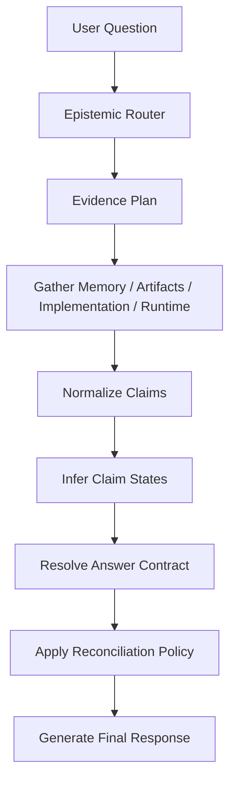

# Answer Contract Resolver - Claim State, Provenance, and Response Operators

## Status: Proposed follow-on to epistemic routing

This document is a follow-on to [epistemic-routing.md](./epistemic-routing.md).

It starts from a challenge:

> Is "scope resolution" the right abstraction for a brain-like memory system,
> or is it only the first obvious fix?

The conclusion of this document is:

- a scope resolver is a useful tactical patch
- it is not the deepest or most durable abstraction
- the real primitive is an **answer contract**

An answer contract tells the agent:

1. what kind of question this is
2. what kind of claims matter
3. what state those claims are in
4. what answer operation the user is actually asking for
5. how the final response should preserve authority, provenance, and time

This is the next layer for Engram if the goal is not just better retrieval,
but a memory architecture that behaves more like a brain for an AI.

---

## 1. Why scope alone is not enough

The motivating example is:

> "is full mode rework by default?"

A simple scope-based system might say:

- raw code default
- install/setup default
- current runtime default

That is already better than a single flat answer.

But it is still not enough.

Why:

1. the user might not actually be asking a pure default question
2. the important distinction may not be scope, but **officialness**
3. the right response may not be "pick one scope" but "compare states"
4. some questions are not asking for truth lookup at all; they are asking for
   recommendation, planning, or synthesis

Example:

> "How would we approach the OpenClaw install plan? What do you think?"

That is not just:

- memory
- artifact
- runtime

It is:

1. inspect current artifacts
2. optionally include prior discussion
3. synthesize a recommendation

Scope does not capture that.

So the critique is:

**Scope is a useful view over truth. It is not the primary control surface.**

---

## 2. The deeper problem

The real problem is not "multiple scopes exist."

The real problem is that a claim can exist in multiple epistemic states at once:

1. mentioned
2. discussed
3. tentatively preferred
4. decided
5. documented
6. implemented
7. effective in the current runtime
8. superseded

And the user can ask different operations over those claims:

1. recall what we said
2. inspect what the repo says
3. reconcile prior discussion with current reality
4. compare multiple sources
5. explain why they differ
6. recommend what we should do next
7. plan an action based on the current state

This is not just retrieval.

It is an answer-planning problem over temporally evolving claims.

That is why the right abstraction should sit between evidence gathering and
final answer generation.

---

## 3. Core thesis

The next architecture should be:

1. `epistemic routing`
   - remember / inspect / reconcile
2. `claim state modeling`
   - discussed / decided / documented / implemented / effective / superseded
3. `answer contract resolution`
   - direct answer / compare / reconcile / timeline / recommend / plan

In this architecture:

- scope is derived from claim state and operator
- source selection is driven by the answer contract
- the final answer preserves provenance instead of flattening disagreement

This is more brain-like than a scope resolver because the system is not merely
choosing where to look. It is deciding how to reason about partially
externalized knowledge.

---

## 4. What an answer contract is

An answer contract is a structured description of what the final answer must do.

Suggested shape:

```python
@dataclass
class AnswerContract:
    operator: str
    requested_truth_kind: str
    relevant_scopes: list[str]
    preferred_authorities: list[str]
    preserve_temporal_distinction: bool
    include_provenance: bool
    allow_recommendation: bool
    confidence: float
```

### 4.1 Operator

This is the most important new field.

Example values:

- `direct_answer`
- `compare`
- `reconcile`
- `timeline`
- `recommend`
- `plan`
- `unresolved_state_report`

These are not source types.

They describe what the answer is supposed to do.

### 4.2 Requested truth kind

Example values:

- `personal_continuity`
- `historical_intent`
- `documented_policy`
- `implemented_behavior`
- `effective_runtime`
- `mixed`

This is closer to what the user actually wants than "memory" or "repo."

### 4.3 Relevant scopes

Scope still matters, but it is downstream:

- `raw_default`
- `install_default`
- `repo_current`
- `runtime_current`
- `historical_discussion`

These are not the first classification. They are one aspect of the answer
contract once the operator is known.

### 4.4 Answer constraints

The contract also determines:

- whether disagreement must be surfaced explicitly
- whether time distinction must be preserved
- whether provenance should be included in the wording
- whether synthesis or recommendation is allowed

This prevents the model from collapsing multi-state evidence into a single
flattened response.

---

## 5. Claim state is the primary semantic unit

If Engram is supposed to be a brain for an AI, then the system should not just
store facts. It should represent the lifecycle of a belief.

Suggested claim states:

1. `mentioned`
   - appears in a single conversation turn or weak artifact hint
2. `discussed`
   - sustained conversation topic or repeated memory trace
3. `tentative`
   - leaning, proposal, candidate plan, unresolved preference
4. `decided`
   - explicit commitment language
5. `documented`
   - written in design docs, README, skill definition, policy artifact
6. `implemented`
   - encoded in code/config defaults or build scripts
7. `effective`
   - true in the current running environment
8. `superseded`
   - replaced by a newer claim on the same predicate

The central insight is:

**A brain-like memory should know not only what a claim is, but how official it
became and whether reality has moved past it.**

---

## 6. Why this is more than epistemic routing

Epistemic routing already answers:

- which sources should be consulted?

That is necessary, but not sufficient.

Answer contracts answer:

- what kind of response is required once those sources are gathered?

The distinction matters because these questions need different behaviors:

### 6.1 "my son did great today in soccer"

Correct operator:

- `direct_answer`

Correct truth kind:

- `personal_continuity`

Correct behavior:

- memory-first
- use omitted referent resolution
- do not over-compare with artifacts

### 6.2 "is full mode rework by default?"

Correct operator:

- `compare`

Correct truth kind:

- `mixed`

Correct behavior:

- compare raw code default vs install default vs effective runtime
- do not pretend there is only one relevant "default"

### 6.3 "what did we decide about launching Engram publicly?"

Correct operator:

- `reconcile` or `unresolved_state_report`

Correct truth kind:

- `historical_intent + documented posture`

Correct behavior:

- preserve whether the decision is final or still open
- distinguish remembered discussion from documented manifestation

### 6.4 "How would we approach the OpenClaw install plan? What do you think?"

Correct operator:

- `recommend`

Correct truth kind:

- `documented_policy + implemented_behavior + some historical context`

Correct behavior:

- inspect first
- reconcile if relevant
- then synthesize advice

This is why operator must be first-class.

---

## 7. Proposed architecture



### 7.1 Stage 1: Epistemic router

Keep the current routing layer:

- `remember`
- `inspect`
- `reconcile`

It remains the source-planning entry point.

### 7.2 Stage 2: Claim normalization

Convert gathered evidence into normalized claims:

- subject
- predicate
- object
- source
- authority
- timestamp
- provenance

This is already partly present in the current epistemic routing work.

### 7.3 Stage 3: Claim-state inference

Add a deterministic claim-state classifier based on:

- lexical markers
- source type
- artifact class
- config/runtime status
- supersession edges

Examples:

- README statement -> likely `documented`
- `.env.example` / config default -> likely `implemented`
- live runtime config -> `effective`
- conversation with "we should probably" -> `tentative`
- conversation with "we decided" -> `decided`

### 7.4 Stage 4: Answer-contract resolution

This layer uses:

- question framing
- claim states
- disagreement structure
- requested action

To emit an answer contract.

Example:

```python
AnswerContract(
    operator="compare",
    requested_truth_kind="mixed",
    relevant_scopes=["raw_default", "install_default", "runtime_current"],
    preferred_authorities=["implemented_behavior", "effective_runtime"],
    preserve_temporal_distinction=False,
    include_provenance=True,
    allow_recommendation=False,
    confidence=0.88,
)
```

### 7.5 Stage 5: Response policy

The answer policy uses the contract to shape the final response.

Examples:

- `direct_answer`
  - answer directly
- `compare`
  - enumerate scoped differences
- `reconcile`
  - distinguish earlier discussion vs current documented/implemented state
- `unresolved_state_report`
  - explicitly say what is still unsettled
- `recommend`
  - separate evidence from advice

This is what stops the model from returning a shallow single-source answer when
the question actually requires a structured comparison.

---

## 8. Why this is more brain-like

A brain is not just a retrieval engine.

A useful memory system for an agent should know:

1. what was experienced
2. what was merely suggested
3. what was agreed on
4. what became written policy
5. what got implemented
6. what is true in the world right now
7. what is outdated but still historically meaningful

That is exactly the terrain covered by claim state + answer contract.

If Engram is solving a novel problem, this is closer to the real target than a
smarter search router.

---

## 9. Concrete examples

### Example A: "is full mode rework by default?"

Naive answer:

- "no, integration_profile defaults to off"

Why that is insufficient:

- true for raw config
- misleading for shipped install defaults
- incomplete for current runtime

Correct contract:

- operator: `compare`
- relevant scopes:
  - raw code default
  - setup/default install path
  - effective runtime now

Desired answer form:

- raw config default: `off`
- setup/install default: `rework`
- current runtime: whatever the environment currently resolves to

### Example B: "what did we decide about launching Engram publicly?"

Naive answer:

- "we decided OpenClaw"

Why that is insufficient:

- it may have been discussed rather than finalized
- the repo may partially reflect it without a formal decision artifact
- unresolvedness may be part of the correct answer

Correct contract:

- operator: `reconcile` or `unresolved_state_report`
- preserve temporal distinction: `True`

Desired answer form:

- what was discussed
- what is documented now
- what remains unresolved

### Example C: "How would we approach the OpenClaw install plan? What do you think?"

Naive answer:

- summarize memory or docs only

Correct contract:

- operator: `recommend`
- allow_recommendation: `True`

Desired answer form:

1. current artifacts and implementation say X
2. prior discussion says Y if relevant
3. therefore the best path now is Z

---

## 10. Design principles

1. **Do not flatten disagreement.**
   If sources differ, the difference is often the answer.

2. **Do not confuse memory with authority.**
   Memory is essential for continuity and provenance, but not always current
   truth.

3. **Do not confuse documentation with runtime.**
   What the README says and what the running system does are not identical.

4. **Do not confuse a truth query with a recommendation request.**
   Some questions require synthesis after inspection.

5. **Treat scope as derived, not primary.**
   Scope helps explain answers; it should not be the sole routing primitive.

---

## 11. Proposed implementation path

### Phase 0: Answer-contract metadata

Add a lightweight contract layer above current epistemic routing.

Implement:

- `operator`
- `requested_truth_kind`
- `relevant_scopes`
- `preserve_temporal_distinction`
- `allow_recommendation`

This phase is mostly deterministic logic and prompt shaping.

### Phase 1: Claim-state inference

Extend normalized claims with inferred state:

- `tentative`
- `decided`
- `documented`
- `implemented`
- `effective`
- `superseded`

Add deterministic extractors for memory phrasing and artifact classes.

### Phase 2: Contract-aware reconciliation

Make reconciliation policy depend on the contract instead of only on route mode.

Examples:

- compare contracts enumerate scoped differences
- unresolved contracts preserve lack of settlement
- recommend contracts separate evidence from advice

### Phase 3: Surface integration

Apply answer contracts across:

- MCP
- knowledge chat
- OpenClaw

The client should not only gather better evidence. It should shape answers in
the right form for the question.

### Phase 4: Graph semantics

Deepen graph support:

- decision state transitions
- supersession chains
- artifact externalization ladders
- effective/runtime overlays

This is where the brain-like provenance model becomes a durable substrate
instead of prompt logic.

---

## 12. README and docs follow-up

This design requires a documentation update after implementation.

Specifically, `README.md` should be updated to explain:

1. the difference between:
   - raw config defaults
   - shipped setup defaults
   - effective runtime state
2. that Engram now distinguishes:
   - memory recall
   - artifact inspection
   - reconciliation
   - scoped or contract-aware answers
3. which endpoints and MCP tools expose:
   - route classification
   - artifact search
   - runtime inspection
   - answer-contract behavior, if surfaced publicly

Without that README update, users will keep interpreting "default" questions in
a flat way and the system behavior will feel inconsistent even when it is
technically correct.

---

## 13. Risks

1. **Over-structuring the answer path**
   - if the contract system becomes too rigid, responses will feel mechanical

2. **Premature state certainty**
   - weak heuristics could label a tentative discussion as a decision

3. **Too many answer forms**
   - if operator taxonomy grows too large, the system becomes hard to tune

4. **Prompt drift across surfaces**
   - MCP, REST, and OpenClaw must share the same answer contract semantics

These are real risks, but they are better risks than continuing to answer
multi-state questions with single-source confidence.

---

## 14. Recommendation

Do not build a standalone `scope resolver` as the main next abstraction.

Instead:

1. keep epistemic routing
2. add claim-state modeling
3. add answer-contract resolution above reconciliation
4. treat scope as a derived field within that contract

That path feels closer to the actual novelty of the problem:

not just helping an AI retrieve more,
but helping an AI know what kind of truth it is speaking from.
