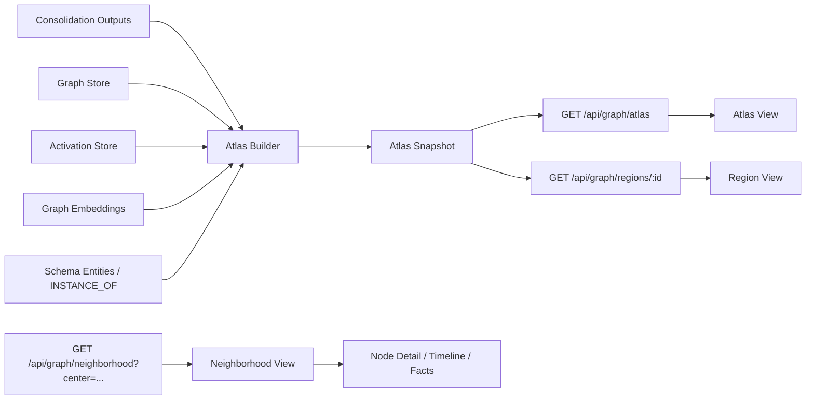

# Brain Atlas - Multi-Scale Graph Visualization and Drill-Down

> Status: implemented — AtlasBuilder, /atlas API, dashboard AtlasView/RegionView


## Status: Proposed Build Path

This document defines how Engram should expose an "ever growing brain" in the
dashboard without trying to render the full raw graph at once.

The current graph implementation is directionally good for local exploration,
but the initial load path is still full-graph oriented:

- `dashboard/src/store/graphSlice.ts` calls `loadNeighborhood(undefined, 3)`
- `server/engram/api/graph.py` treats `center=None` as "load everything"
- `dashboard/src/components/GraphExplorer.tsx` passes that raw graph into
  `react-force-graph`

That is the wrong shape for a graph that is supposed to keep growing for the
life of the user.

## Summary

Engram should move from one graph view with render-time LOD to a multi-scale
brain map:

1. `Atlas` view for the whole memory system
2. `Region` view for one semantic area of the graph
3. `Neighborhood` view for local entity exploration
4. `Node` view for detail panels and timelines

The important design change is this:

> LOD should stop being only a renderer trick. It should become a data model.

The atlas and region views should be abstracted, precomputed, and stable. The
current `GraphExplorer` should remain, but only as the neighborhood-detail
renderer.

## Why Rework The Graph Surface

Today the graph is trying to solve two different product jobs with one
primitive:

1. "Show me my whole brain"
2. "Let me inspect a local cluster in detail"

Those jobs have different scaling limits.

The current graph stack already contains useful ideas:

- tiered LOD in `dashboard/src/components/graph/LODController.ts`
- batched renderers for active, dormant, and edge tiers
- adjacency-based pulse propagation

But the expensive part still scales with the loaded raw graph because hidden
nodes still enter the live simulation. That means:

- simulation cost grows with all loaded nodes, not just visible nodes
- initial graph load becomes slower as memory grows
- full-graph views become noisier instead of more informative
- renderer caps eventually cause silent omission

This is acceptable for neighborhood inspection. It is not acceptable for the
"brain map" experience.

## Goals

1. Give users a truthful whole-brain view at any graph size.
2. Preserve a stable mental map across sessions and graph growth.
3. Let users drill from global structure to a specific memory in 1-3 clicks.
4. Keep neighborhood exploration rich without loading the whole graph.
5. Reuse existing consolidation outputs: communities, schemas, activation, and
   graph embeddings.
6. Maintain lite/full parity at the API contract level.

## Non-Goals

1. Rendering every raw entity in the initial dashboard graph view.
2. Replacing the current node detail panel, search UI, or timeline.
3. Replacing consolidation phases or ACT-R activation semantics.
4. Introducing a new ML dependency just to cluster the graph.
5. Solving temporal graph playback beyond neighborhood scope in the first pass.

## Design Principles

1. Honest abstraction. The UI should say when a node represents 500 memories.
2. Stable geography over perfect geometry. Positions should remain recognizable
   between sessions.
3. Precompute global, simulate local. Force layout is for neighborhoods, not
   the whole brain.
4. Drill-down beats hairball. Every scope should answer "where do I go next?"
5. Activation is an overlay, not the structural layout.
6. No unbounded initial load. The dashboard must never fetch the full raw graph
   by default.

## Product Model

### 1. Atlas View

Atlas is the default graph landing view.

Each atlas node is a `region`, not an entity. A region represents a coherent
semantic area such as identity, work, people, projects, places, or a strong
schema cluster.

Atlas should communicate:

- total memory mass
- major regions
- bridge strength between regions
- current activation heat
- recent growth

Example copy:

- `34 regions representing 18,420 memories`
- `Work Systems is active now`
- `Family grew by 12 memories this week`

### 2. Region View

Region is the middle layer between atlas and neighborhood.

It shows:

- top hub entities
- important schema nodes
- subclusters inside the region
- bridge entities connecting outward

This view is still abstracted. It does not attempt to display every raw member.

### 3. Neighborhood View

Neighborhood is the current `GraphExplorer` domain.

It is centered on a specific entity and can continue to use:

- live activation overlays
- pulse propagation
- force layout
- detailed labels and relationship inspection

Neighborhood should be explicitly local. It is no longer the default full-brain
mode.

### 4. Node View

Node view remains the existing detail panel, timeline navigation, and knowledge
surfaces around a selected entity.

## Target Architecture



## Core Model

### 1. Atlas Read Model

Add a new backend module:

- `server/engram/atlas/builder.py`
- `server/engram/atlas/service.py`
- `server/engram/atlas/types.py`

The atlas read model is a materialized summary of the graph for one `group_id`.
It is not a replacement for the graph store. It is a dashboard-oriented
projection.

Inputs:

- entities and relationships from the graph store
- activation snapshots or aggregated access telemetry
- schema entities and `INSTANCE_OF` edges
- graph structural embeddings when available
- community assignments as a seed signal

Outputs:

- stable region definitions
- region-to-region bridge edges
- representative hub entities
- precomputed region positions
- growth and activation aggregates
- region membership mapping for drill-down

### 2. Region Formation

Region formation should be deterministic and dependency-light.

First pass algorithm:

1. Start from community assignments produced by the existing community logic in
   `server/engram/activation/community.py`.
2. Fold schema instances toward their schema region using `INSTANCE_OF` edges.
3. Merge tiny communities into the strongest neighboring region by bridge
   weight.
4. Split oversized communities using graph-embedding centroids when
   `node2vec` exists, otherwise split by top-hub seeded partitioning.
5. Preserve an explicit identity region if identity-core entities are present.

Recommended thresholds:

- `atlas_region_min_members = 12`
- `atlas_region_target_members = 150`
- `atlas_region_split_threshold = 600`
- `atlas_max_regions = 96`

These numbers are display-oriented, not storage-oriented.

### 3. Stable Region IDs

The atlas cannot reuse raw community labels as UI IDs. Those labels are too
ephemeral.

Region IDs must be stable across rebuilds:

1. Load the previous atlas snapshot for the same `group_id`
2. Match new candidate regions to previous regions by Jaccard overlap of member
   entity IDs
3. Reuse the prior `region_id` when overlap is above a threshold such as `0.45`
4. Create a new `region_<uuid>` only when no prior region matches

This preserves the user's mental map even as entities merge, split, and grow.

### 4. Region Labels

Each region should expose:

- `label`
- `subtitle`
- `kind`

Label generation order:

1. top schema names if present
2. top hub entity names
3. dominant entity type pattern

Examples:

- `Identity`
- `Work Systems`
- `Family and Home`
- `Customers / Product Feedback`

`kind` should initially be:

- `identity`
- `domain`
- `schema_cluster`
- `mixed`

### 5. Layout Generation

Atlas and region positions should be precomputed, not force-simulated in the
browser.

Preferred approach:

1. Build one vector per region as the weighted centroid of member graph
   embeddings
2. Project region vectors into 2D or 3D using deterministic PCA
3. Normalize coordinates and store them with the snapshot

Fallback when structural embeddings are unavailable:

1. Build the region bridge graph
2. Run an offline spring layout once on the server
3. Persist the result

Layout rules:

- positions should be stable unless the region truly moved
- bridge-heavy regions should end up closer
- identity and core self regions should be spatially prominent

### 6. Representation Metadata

Every graph response should include explicit representation metadata so the UI
never implies "this is everything on screen."

```ts
interface GraphRepresentationMeta {
  scope: "atlas" | "region" | "neighborhood" | "temporal";
  layout: "precomputed" | "force";
  representedEntityCount: number;
  representedEdgeCount: number;
  displayedNodeCount: number;
  displayedEdgeCount: number;
  snapshotId?: string;
  truncated: boolean;
}
```

This metadata should be shown in the UI.

## API Contract

### 1. `GET /api/graph/atlas`

New default dashboard endpoint.

Purpose:

- fetch the whole-brain summary
- return region nodes and inter-region bridges
- expose aggregate metadata for copy and legends

Suggested response shape:

```ts
interface AtlasResponse {
  representation: GraphRepresentationMeta;
  generatedAt: string;
  regions: Array<{
    id: string;
    label: string;
    subtitle: string | null;
    kind: "identity" | "domain" | "schema_cluster" | "mixed";
    memberCount: number;
    representedEdgeCount: number;
    activationScore: number;
    growth7d: number;
    growth30d: number;
    dominantEntityTypes: Record<string, number>;
    hubEntityIds: string[];
    schemaIds: string[];
    x: number;
    y: number;
    z: number;
  }>;
  bridges: Array<{
    id: string;
    source: string;
    target: string;
    weight: number;
    relationshipCount: number;
  }>;
  stats: {
    totalEntities: number;
    totalRelationships: number;
    totalRegions: number;
    hottestRegionId: string | null;
    fastestGrowingRegionId: string | null;
  };
}
```

### 2. `GET /api/graph/regions/{region_id}`

New drill-down endpoint.

Purpose:

- expand a single atlas region
- show its representative hubs, schemas, and subclusters
- keep the response display-bounded

Suggested response shape:

```ts
interface RegionResponse {
  representation: GraphRepresentationMeta;
  region: {
    id: string;
    label: string;
    subtitle: string | null;
    kind: "identity" | "domain" | "schema_cluster" | "mixed";
    memberCount: number;
  };
  nodes: Array<{
    id: string;
    kind: "hub" | "schema" | "cluster" | "bridge";
    label: string;
    representedEntityCount: number;
    activationScore: number;
    growth30d: number;
    x: number;
    y: number;
    z: number;
    entityId?: string;
  }>;
  edges: Array<{
    id: string;
    source: string;
    target: string;
    weight: number;
    predicateHint: string | null;
  }>;
  topEntities: Array<{
    id: string;
    name: string;
    entityType: string;
    activationCurrent: number;
  }>;
}
```

Phase 1 may build this on demand from atlas membership plus graph-store reads.
Phase 2 should materialize it with the atlas snapshot.

### 3. `GET /api/graph/neighborhood`

This endpoint remains, but its role changes.

New rules:

- `center` becomes required for dashboard use
- no-center full-graph mode is deprecated immediately
- neighborhood responses remain raw-entity oriented
- `representation.scope` must be `neighborhood`
- `representation.layout` must be `force`

The current dashboard should stop calling this endpoint for initial graph load.

### 4. `GET /api/graph/at`

Temporal graph playback stays neighborhood-scoped in the first implementation.

Do not attempt temporal atlas playback in Phase 1.

## Storage And Backend Interfaces

### 1. New Protocol

Add an atlas read-model protocol:

- `server/engram/storage/protocols.py`

Suggested interface:

```py
class AtlasStore(Protocol):
    async def get_latest_snapshot(self, group_id: str) -> AtlasSnapshot | None: ...
    async def save_snapshot(self, snapshot: AtlasSnapshot) -> None: ...
    async def get_region_members(
        self, snapshot_id: str, region_id: str, group_id: str
    ) -> list[str]: ...
```

### 2. SQLite Implementation

Add tables for:

- `atlas_snapshots`
- `atlas_regions`
- `atlas_region_members`
- `atlas_region_edges`

Store region layout and aggregate metrics directly in the atlas tables. Store
member mappings separately for drill-down and region rebuilds.

### 3. Full-Mode Implementation

Full mode must expose the same API behavior.

Recommended path:

- add a `FalkorAtlasStore` backed by Redis hashes or JSON blobs
- keep the contract identical to SQLite
- avoid depending on `get_schema_members()` in the first pass because
  `server/engram/storage/falkordb/graph.py` does not yet implement it

That means Phase 1 region building should rely on:

- entity metadata
- raw relationships
- `INSTANCE_OF` edges
- graph embeddings when present

Schema-member enrichment can be added later without changing the API.

## Atlas Build Lifecycle

The atlas is a read model and should rebuild when the graph meaningfully
changes.

Recommended triggers:

1. cold-tier consolidation completion
2. `graph_embed` completion
3. schema formation completion
4. manual admin rebuild
5. thresholded background rebuild when entity or edge count changed by more than
   `5%` since the last snapshot

Phase 1 can compute atlas on demand and cache it briefly in memory. Phase 2
should persist snapshots and rebuild incrementally.

## Frontend Architecture

### 1. Split Graph Scopes In State

The current `GraphSlice` is neighborhood-shaped. Do not keep overloading it for
atlas semantics.

Add a new scope model in `dashboard/src/store/types.ts`:

```ts
type BrainMapScope = "atlas" | "region" | "neighborhood" | "temporal";
```

Recommended state additions:

- `brainMapScope`
- `activeRegionId`
- `atlasSnapshotId`
- `breadcrumbs`
- `representation`
- `atlasData`
- `regionData`
- `neighborhoodData`

Recommended actions:

- `loadAtlas()`
- `loadRegion(regionId)`
- `loadNeighborhood(centerId, depth?)`
- `backToAtlas()`
- `backToRegion(regionId)`

### 2. Initial Load Behavior

Replace:

- `loadInitialGraph() -> loadNeighborhood(undefined, 3)`

With:

- `loadInitialGraph() -> loadAtlas()`

This is the single highest-value behavioral change in the dashboard.

### 3. Rendering Split

Do not try to make atlas and neighborhood live inside the same force-graph
primitive.

Recommended component split:

- `dashboard/src/components/BrainMapPanel.tsx`
- `dashboard/src/components/graph/AtlasView.tsx`
- `dashboard/src/components/graph/RegionView.tsx`
- `dashboard/src/components/GraphExplorer.tsx` for neighborhood only

Renderer rules:

- Atlas: precomputed positions, no force simulation
- Region: precomputed positions, no force simulation
- Neighborhood: existing force-based explorer, reduced node budget

Once atlas and region are real scopes, `dashboard/src/components/graph/LODController.ts`
should only manage neighborhood-level detail. Macro and region should stop being
camera tiers on the raw graph and become data-driven views instead.

### 4. Search And Navigation

Search result click behavior:

1. search for an entity
2. jump directly to `Neighborhood(center=entityId)`
3. set breadcrumbs like `Atlas > Work Systems > React Compiler`

Region click behavior:

1. atlas node click loads region
2. region hub click loads neighborhood

### 5. Honest UI Copy

The graph UI should say what is represented.

Examples:

- `Atlas: 42 regions representing 22,104 entities`
- `Region: 18 hubs representing 612 entities`
- `Neighborhood: 184 displayed nodes around React Compiler`

If a display budget is hit, the UI must show it. Silent omission is not
acceptable.

## Performance Budgets

These are implementation budgets, not aspirational goals.

| Scope | Represented Size | Display Budget | Layout | Notes |
| --- | --- | --- | --- | --- |
| Atlas | up to entire graph | 24-96 regions, 64-256 bridges | precomputed | default landing view |
| Region | 100-5,000 member entities | 50-600 display nodes, 100-1,200 edges | precomputed | no force simulation |
| Neighborhood | local 1-3 hop subgraph | default 150-1,500 raw nodes | force | detailed inspection only |

Hard rules:

1. `dashboard/src/store/preferencesSlice.ts` should no longer default
   `graphMaxNodes` to `50000`
2. default neighborhood budget should land around `1500`
3. advanced users may opt up, but dashboard defaults should stay local
4. no scope may silently clip nodes due to renderer-internal caps

## Implementation Plan

### Phase 1. Atlas Landing View And Safer Neighborhood Defaults

Problem:

- initial graph load still pulls the raw graph
- atlas abstraction does not exist yet

Deliverables:

- add `GET /api/graph/atlas`
- add atlas client types in `dashboard/src/api/client.ts`
- add `brainMapScope` and `loadAtlas()` in the dashboard store
- replace default graph load with atlas load
- lower default `graphMaxNodes`
- make `GraphExplorer` neighborhood-only
- show representation metadata in the UI

Acceptance criteria:

- opening the dashboard graph tab does not call `/api/graph/neighborhood`
  without a `center`
- graph initial payload size no longer scales linearly with entity count
- the UI shows region nodes and bridge lines on initial load
- clicking a region drills into a region view or directly into a neighborhood
- selecting a search result still opens a detailed local graph

Suggested test coverage:

- API contract test for `/api/graph/atlas`
- store test proving `loadInitialGraph()` calls `loadAtlas()`
- component test for atlas drill-down
- regression test that no-center neighborhood fetch is not used by the shell

### Phase 2. Materialized Snapshots And Region Drill-Down

Problem:

- on-demand atlas computation will eventually become too expensive
- region view needs stable identity and layout

Deliverables:

- add `AtlasStore` protocol and implementations
- persist atlas snapshots and region membership
- add `GET /api/graph/regions/{region_id}`
- preserve region IDs across rebuilds
- materialize precomputed region positions
- add breadcrumbs and back-navigation

Acceptance criteria:

- two consecutive atlas rebuilds on an unchanged graph preserve region IDs and
  positions within tolerance
- region drill-down returns bounded display data and membership-derived stats
- lite and full modes return the same response shape

Suggested test coverage:

- region ID stability test
- lite/full parity tests
- snapshot rebuild trigger tests
- frontend breadcrumb navigation tests

### Phase 3. Growth, Recency, And Brain Health Overlays

Problem:

- the atlas shows structure, but not yet the feeling of a living memory system

Deliverables:

- region growth metrics for 7d and 30d
- activation heat overlays
- "new since last visit" markers
- optional atlas timeline scrubbing at snapshot granularity

Acceptance criteria:

- users can tell which regions are growing
- users can tell which regions are active now
- the atlas feels alive without loading the raw graph

## File-Level Build Map

Expected backend touch points:

- `server/engram/api/graph.py`
- `server/engram/storage/protocols.py`
- `server/engram/storage/sqlite/schema.sql`
- `server/engram/storage/sqlite/graph.py`
- `server/engram/storage/falkordb/graph.py`
- new `server/engram/atlas/` package

Expected frontend touch points:

- `dashboard/src/api/client.ts`
- `dashboard/src/store/types.ts`
- `dashboard/src/store/graphSlice.ts`
- `dashboard/src/store/preferencesSlice.ts`
- `dashboard/src/components/DashboardShell.tsx`
- new `dashboard/src/components/BrainMapPanel.tsx`
- new `dashboard/src/components/graph/AtlasView.tsx`
- new `dashboard/src/components/graph/RegionView.tsx`
- existing `dashboard/src/components/GraphExplorer.tsx`

## Risks And Open Questions

1. Full-mode schema-member parity is incomplete today, so Phase 1 region logic
   should not rely on `get_schema_members()`.
2. Current community labels are useful seeds but not stable UI identifiers.
3. If graph embeddings are missing, the fallback layout must still be
   deterministic.
4. Region labels should be generated conservatively. Bad labels will hurt trust
   more than generic ones.
5. Atlas rebuild cadence must be frequent enough to feel alive, but not so
   frequent that region geography constantly shifts.

## Definition Of Done

This rework is complete when all of the following are true:

1. the graph tab opens to an atlas instead of a raw full-graph simulation
2. users can drill from atlas to region to neighborhood in a stable way
3. no default dashboard path loads the entire raw graph without a center
4. atlas and region views use precomputed layout, not browser force simulation
5. neighborhood view remains rich and interactive for local exploration
6. the UI explicitly states what is represented and what is abstracted
