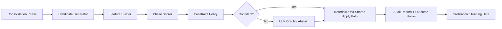

# Consolidation Rework — Correctness, Deterministic Decisioning, and Store Parity

> Status: implemented behind integration_profile=rework — not the consumer default (quiet + wave2)


## Status: Proposed Build Path

This document proposes a rework of Engram's consolidation pipeline.

The current 17-phase design is directionally strong. The main gaps are not
conceptual. They are:

- hidden correctness bugs that prevent intended behavior
- SQLite/FalkorDB parity gaps
- duplicated write logic across phases
- over-reliance on LLMs as generic judges where constrained decision systems
  would be cheaper, more consistent, and easier to audit

The recommendation is not "remove all LLM usage." The recommendation is to
reframe consolidation as a constrained decision stack:

1. generate candidates deterministically
2. score them with phase-specific features and small learned models
3. apply hard symbolic constraints
4. abstain or escalate only the uncertain band to an LLM oracle

That should meet or exceed the current LLM-backed behavior for merge and infer,
while materially improving cost, latency, consistency, and debuggability.

## Summary

The rework has four tracks:

1. Fix correctness issues already blocking intended consolidation behavior.
2. Define a real cross-store consolidation contract so SQLite and FalkorDB run
   the same pipeline semantics.
3. Replace generic LLM judging with phase-specific neuro-symbolic decision
   systems.
4. Turn audit logs into a continuous training and calibration loop so the
   system improves without making the hot path more expensive.

This is an enhancement plan, not a ground-up rewrite. The pipeline shape stays:

```text
triage -> merge -> calibrate -> infer -> evidence_adjudication
-> edge_adjudication -> replay -> prune -> compact -> mature
-> semanticize -> schema -> reindex -> graph_embed -> microglia -> dream
```

What changes is the execution discipline around each phase.

## Why Rework Consolidation

Consolidation is where Engram converts stored episodes into durable structure.
If this pipeline is inconsistent, too permissive, or store-dependent, the rest
of the system inherits the damage:

- duplicate entities fragment recall
- low-precision inferred edges pollute traversal
- replay can create relationships ingestion would reject
- maturity and semantic promotion drift apart across storage modes
- dream reinforcement can strengthen the wrong predicate

The current system also uses LLMs in a narrow role: judging constrained
candidate sets. That is a poor use of an expensive general model. In these
phases, the LLM is not doing open-ended synthesis. It is mostly approximating a
decision function over typed inputs. That is exactly where a constrained
neuro-symbolic system is likely to outperform it.

## Goals

1. Make consolidation correct before making it more sophisticated.
2. Enforce identical consolidation semantics across SQLite and FalkorDB.
3. Centralize relationship and entity application logic so replay, infer, and
   ingestion cannot diverge.
4. Replace generic LLM hot-path judging with phase-specific calibrated
   scorers.
5. Preserve flexibility by using abstention and escalation, not by forcing one
   model to handle every case.
6. Improve auditability so every phase decision can be traced, evaluated, and
   retrained.

## Non-Goals

1. Replacing the extraction model used by `project_episode()`.
2. Rewriting ACT-R retrieval or spreading activation.
3. Removing all LLM usage in the first iteration.
4. Replacing the existing phase order unless later evidence demands it.
5. Shipping a generic "one model for consolidation" architecture.

## Design Principles

1. Correctness before cleverness. A broken deterministic path is worse than no
   path.
2. One write path per semantic operation. Relationship semantics should live in
   one place.
3. Candidate generation first, judgment second. Never ask a model to search the
   whole world when a phase can first narrow the space.
4. Hard constraints before soft preferences. Type compatibility,
   contradiction rules, exclusivity, and tier semantics should never depend on
   model mood.
5. Audit every decision. If a phase cannot explain why it acted, it cannot be
   tuned safely.
6. LLM as oracle, not default. Use the LLM for disagreement, uncertainty, or
   out-of-distribution cases.

## Current-State Findings

The following issues were confirmed during review and should be treated as the
starting point for this rework.

### Correctness defects

1. **PMI inference is effectively disabled in practice.**
   `InferPhase` reads `total_episodes`, while the stores expose `episodes`.
   Result: PMI-enabled configurations still fall back to plain co-occurrence.

2. **`merge_require_same_type` is bypassed on the ANN path.**
   Typed merge safety is enforced on some paths but not on embedding candidates,
   allowing cross-type unions even when same-type merging is configured.

3. **Replay is not semantically equivalent to ingestion.**
   Replay applies weaker relationship logic than `project_episode()` and can
   create edges that the ingestion path would reject, fold, or reinterpret.

4. **Dream reinforcement is pair-based, not relationship-based.**
   Weight updates are applied by node pair, so multiple predicates between the
   same entities are boosted or decayed together.

### Store parity defects

5. **FalkorDB does not implement methods required by late phases.**
   `mature` depends on episode count, temporal span, and relationship-type
   queries that are missing in the Falkor store implementation.

6. **FalkorDB episode persistence is not round-tripping tiered-state fields.**
   Episode tier, consolidation cycle count, and entity coverage are not fully
   created and reloaded, which undermines `semanticize`.

### Quality and architecture gaps

7. **Triage has dead or inert signals.**
   Embedding surprise is not wired in, outcome calibration is not learning from
   production behavior, and at least one episode is always extracted even if
   all scores are poor.

8. **Incremental graph embedding is mostly aspirational.**
   Existing embeddings are passed through the phase but ignored by current
   trainers, so "incremental" still retrains globally.

9. **Merge's negative cache can freeze bad decisions.**
   The in-memory `keep_separate` cache persists without evidence expiry or
   invalidation when entity summaries or neighborhoods change.

10. **Schema formation does not actually prefer mature structure.**
    The implementation can still elevate noisy episodic motifs despite the
    stated intent to prefer mature entities.

11. **Replay candidate selection can miss eligible episodes.**
    It scans only a shallow recent window before filtering, so a burst of
    ineligible recent episodes can starve replay.

12. **Infer validates after materialization.**
    Some edge candidates are created before the full validation decision is
    known, which adds churn and makes audit trails harder to trust.

## Target Architecture



Every mutable phase should follow this pattern:

1. Generate a bounded candidate set.
2. Build transparent, typed features.
3. Score with deterministic heuristics or a phase-local learned model.
4. Apply hard graph constraints.
5. Materialize through shared entity/relationship semantics.
6. Log the decision and later outcome.

This is the flexibility story that should replace generic LLM dependence.
Flexibility comes from:

- rich candidate generators
- composable features
- calibrated abstention
- constrained escalation

It does not require a monolithic model to reason about everything.

## Cross-Cutting Rework

### 1. Consolidation Store Contract

Introduce an explicit consolidation-facing store protocol. Phases should depend
on a declared contract rather than opportunistic methods on storage classes.

Required properties:

- every phase declares the store capabilities it needs
- startup or profile activation fails loudly if a required capability is absent
- SQLite and FalkorDB run the same parity suite against the same protocol

Required contract areas:

- entity statistics
- episode statistics
- typed relationship reads and writes
- episode tier persistence
- co-occurrence and structural candidate queries
- schema and embedding metadata

This should eliminate the current class of "phase works in lite mode but not
full mode" failures.

### 2. Shared Apply Path for Entities and Relationships

Replay, infer, and future consolidation phases should not hand-roll
relationship semantics.

Introduce a shared write surface for extracted or proposed graph updates:

- duplicate detection
- contradiction handling
- exclusivity semantics
- polarity rules
- weight bump rules
- identity-core handling
- relationship-key identity

At minimum, relationship identity should become predicate-aware:

```text
relationship_key = (source_id, predicate, target_id, directionality)
```

This is required for both replay correctness and dream edge-level updates.

### 3. Decision Trace Standard

Expand phase audit records into a standard decision trace:

- candidate id
- features used
- score
- threshold band
- hard constraints hit
- decision source
  - rule
  - local model
  - LLM oracle
- policy version

The trace should support both debugging and supervised distillation.

### 4. Outcome Labeling Loop

The system already emits audit records. The next step is to connect them to
later outcomes:

- merge regret
  - split requested, contradiction detected, or high-conflict neighborhood
- inference regret
  - edge retracted, contradicted, or never reused
- triage yield
  - later extraction value, recall usage, schema participation, maturity gain
- prune regret
  - entity recreated or recalled soon after pruning

This data should feed calibration and model training. The LLM should become a
teacher for the uncertainty band, not the primary judge forever.

## Phase-by-Phase Proposal

### 0. Triage

**Current state**

- Good concept: cheap pre-selection for extraction.
- Weakness: important signals are inert and there is no true abstention.

**Rework**

Treat triage as an `episode utility` estimator, not a vague importance score.
The goal is to predict whether extracting an episode now is worth the cost.

Proposed signals:

- explicit preference or correction markers
- identity and profile statements
- task commitment or open-loop indicators
- novelty versus recently active entities
- discourse type
- temporal specificity
- named-entity density
- embedding surprise against active graph state

Policy changes:

- allow zero extractions if nothing crosses a calibrated threshold
- keep deterministic "always extract" guards for corrections, explicit
  preferences, and durable user profile facts
- use the same scorer in the worker and offline triage

Longer term:

- train a lightweight utility model on downstream outcomes
- keep the LLM only for out-of-distribution discourse classification if needed

### 1. Merge

**Current state**

- This phase is already closest to a strong non-LLM solution.
- The deterministic name and alias logic is valuable.
- Biggest gaps are typed safety and stale negative memory.

**Rework**

Split merge into three stages:

1. Typed candidate generation
   - normalized names
   - aliases
   - FTS
   - ANN
   - structural neighbors
2. Pairwise identity scoring
   - name features
   - alias overlap
   - embedding similarity
   - summary consistency
   - neighborhood overlap
   - type compatibility
3. Global cluster solve
   - hard cannot-link constraints
   - same-type enforcement
   - thresholded union-find or correlation clustering

Required changes:

- enforce same-type rules on every candidate path, including ANN
- move `keep_separate` into a persisted evidence-aware cache with TTL or
  fingerprint invalidation
- record merge explanations so false positives can be traced

LLM role:

- only judge uncertain pairs after deterministic and local-model scoring
- use LLM outcomes as training labels, not permanent hot-path policy

### 2. Infer

**Current state**

- Strong concept: infer structure from co-occurrence plus validation.
- Main issue: the best statistical path is effectively inactive.
- Materialization happens too early.

**Rework**

Infer should operate in two steps:

1. Candidate generation
   - co-occurrence counts
   - PMI
   - schema expectation gaps
   - typed structural holes
   - explicit extraction omissions discovered during replay
2. Relationship scoring and validation
   - type compatibility
   - embedding coherence
   - degree and ubiquity penalties
   - motif plausibility
   - temporal consistency
   - contradiction risk

Required changes:

- fix PMI by using the real episode count key and store method contract
- validate before creating edges
- route accepted edges through the shared relationship apply path
- distinguish provisional from durable inferred edges if needed

Longer term:

- replace generic judging with a typed link predictor
- calibrate per predicate family, not one global threshold

### 3. Replay

**Current state**

- Valuable because ingestion can miss structure.
- Problem: replay is a weaker parallel ingestion path instead of a true
  re-application path.

**Rework**

Replay should not implement its own relationship semantics. It should:

1. re-extract candidate entities and relations
2. compute the delta against what the episode already projected
3. apply that delta through the same entity/relationship logic used by
   ingestion

Other changes:

- expand episode selection so the phase scans until it finds enough eligible
  episodes instead of filtering a shallow fixed window
- gate replay on meaningful upstream graph changes, not just recency
- log whether replay produced net-new durable structure

### 4. Prune

**Current state**

- Mostly sound.
- Existing protections around activation, emotional salience, maturity, and
  goals are directionally correct.

**Rework**

Keep prune conservative. The main changes should be observational:

- add a prune regret metric
- protect entities with recent infer or schema participation
- measure how often pruned entities are recreated or rapidly recalled

No major algorithmic rewrite is needed unless regret proves high.

### 5. Compact

**Current state**

- One of the strongest phases today.
- Behavior is simple, bounded, and aligned with activation semantics.

**Rework**

Preserve the current approach. Only add:

- parity tests across stores
- explicit invariants around access-history preservation
- a versioned compaction policy so behavior changes are auditable

### 6. Mature

**Current state**

- Reasonable heuristic baseline in SQLite.
- Blocked by missing FalkorDB capability support.

**Rework**

Keep maturity heuristic-driven, but make it store-independent.

Recommended model:

- compute maturity features from a shared feature extractor
- persist or cache the feature bundle per entity
- promote based on transparent thresholds

Core features:

- source diversity
- temporal span
- relationship-type diversity
- access regularity
- reconsolidation count
- identity-core status

This phase should not depend on store-specific ad hoc queries that exist in one
backend but not the other.

### 7. Semanticize

**Current state**

- Useful but simplistic.
- Sensitive to episode metadata parity and ordering effects.

**Rework**

Semantic promotion should be based on stable support, not just cycle count plus
coverage.

Suggested criteria:

- fraction of linked mature entities
- support from more than one episode or source window
- absence of strong contradiction signals
- minimum consolidation age

Required prerequisite:

- full round-trip support for episode tier fields in every store

### 8. Schema

**Current state**

- Good first pass at motif mining.
- Lacks a real maturity preference.

**Rework**

Schema formation should prefer stable relational patterns over noisy episodic
coincidence.

Changes:

- bias candidate motifs toward mature entities and mature edges
- require recurrence across time windows or source diversity
- canonicalize fingerprints so semantically identical motifs collapse together
- record why a schema was promoted

This phase should remain deterministic. It does not need LLM support.

### 9. Reindex

**Current state**

- Pragmatic and clean.

**Rework**

Keep the phase, but make dirty-set tracking more precise so reindexing follows
actual graph mutations rather than broad phase completion.

### 10. Graph Embed

**Current state**

- Useful, but incremental retraining is mostly not real.

**Rework**

Make "incremental" explicit:

- warm-start trainers from existing embeddings when supported
- train on a dirty subgraph when graph delta is small
- fall back to full retrain only when change exceeds a threshold
- persist trainer version and graph snapshot metadata

If true incrementality is not feasible for a trainer, the phase should say so
and schedule retraining honestly.

### 11. Dream

**Current state**

- The most novel phase in the pipeline.
- Current weakness is update granularity, not the core idea.

**Rework**

Split dream into two separate concerns:

1. **Dream reinforcement**
   - edge-level LTP/LTD on existing predicates
   - predicate-aware updates only
2. **Dream associations**
   - temporary cross-domain edges for creative linkage
   - already covered in the separate dream associations design

Required changes:

- make weight updates relationship-key aware
- prevent one predicate from piggybacking on another's reinforcement
- keep temporary dream edges excluded from normal Hebbian reinforcement

## Replacing Generic LLM Judging

### Why a local system can match or exceed the current LLM role

In consolidation, the LLM is usually not inventing structure from scratch. It
is deciding among bounded alternatives:

- are these two entities the same?
- is this inferred edge plausible?
- should this episode be extracted now?

That is a supervised, constrained decision problem. A local system can win
because it can combine:

- hard graph rules
- typed features
- calibrated thresholds
- abstention
- persistent memory of past outcomes

The LLM's main advantage is coverage on novel cases. That can be preserved by
using it only for the uncertainty band.

### Proposed decision stack

For `merge`, `infer`, and eventually `triage`, use this common pattern:

1. Deterministic narrowing
2. Feature extraction
3. Small local scorer
4. Constraint solve
5. Abstain or escalate

Candidate model classes:

- gradient-boosted trees for structured pairwise scoring
- compact transformer or cross-encoder for hard textual comparisons
- typed link prediction model for infer
- calibrated logistic head over transparent hand-built features

This is not less flexible than an LLM in practice for these tasks. It is more
flexible operationally because it can:

- run cheaply every cycle
- expose confidence and feature contributions
- be versioned safely
- improve from Engram-specific errors

### LLM role after rework

Keep the LLM in three places:

1. uncertainty resolution
2. out-of-distribution candidates
3. periodic labeling and evaluation

That preserves the upside of general reasoning without making the whole system
depend on a costly black box.

## Implementation Roadmap

### Stage 0: Correctness and Parity

Ship the defects that currently block intended behavior.

- fix PMI episode-count lookup
- enforce same-type merge on ANN path
- route replay through shared relationship semantics
- make dream updates predicate-aware
- implement late-phase FalkorDB methods
- round-trip episode tier fields in FalkorDB

Exit criteria:

- consolidation parity tests pass in SQLite and FalkorDB
- replay and ingestion agree on relationship handling
- PMI-enabled infer produces PMI-backed decisions

### Stage 1: Shared Infrastructure

Build the substrate needed for phase-local intelligence.

- consolidation store protocol
- shared apply path for graph updates
- standard decision traces
- outcome-label logging

Exit criteria:

- all mutable phases emit structured decision traces
- no mutable phase writes relationships through bespoke logic

### Stage 2: Phase-Local Scoring

Start with the phases most likely to beat current LLM behavior.

- triage utility scorer
- merge pairwise identity scorer plus cluster policy
- infer typed link scorer

Exit criteria:

- LLM usage drops sharply without recall-quality regression
- local scorers outperform current rule-only baselines on held-out audits

### Stage 3: Distillation and Calibration

Use audit history plus selective LLM labels to refine the local models.

- train on real false positives and false negatives
- maintain confidence calibration per phase
- keep explicit abstention bands

Exit criteria:

- oracle usage is concentrated in novel or ambiguous cases
- model confidence meaningfully predicts error rate

### Stage 4: Optional Deeper Enhancements

- stronger incremental graph embedding
- richer schema recurrence modeling
- maturity feature caching
- cross-phase utility optimization

## Success Metrics

### Correctness

- zero cross-type merges when same-type enforcement is enabled
- replay and ingestion produce identical relationship semantics on the same
  extracted facts
- dream reinforcement changes only the targeted relationship
- SQLite/FalkorDB parity suite passes for all enabled phases

### Quality

- lower false merge rate
- higher inferred-edge precision
- higher replay net-yield
- higher schema precision
- lower prune regret

### Efficiency

- lower LLM calls per consolidation cycle
- lower cost per cycle
- lower p95 phase latency
- honest incremental graph-embedding runtime reduction

### Operability

- every mutable decision has a traceable explanation
- phase confidence bands correlate with real error rates
- bad decisions can be replayed and re-scored offline

## Risks and Open Questions

1. **Label quality.**
   Some outcomes are only weak proxies for truth. The system should separate
   hard labels from heuristic feedback.

2. **Threshold drift.**
   Phase-local models require ongoing calibration or they will become brittle as
   the graph evolves.

3. **Store complexity.**
   Cross-store parity can add implementation burden. That is acceptable because
   the current hidden divergence is more costly.

4. **False confidence.**
   A local model that is cheap but badly calibrated is worse than an LLM that
   abstains. Confidence and abstention need first-class treatment.

5. **Feature leakage across phases.**
   Shared signals are useful, but each phase should still optimize for its own
   objective rather than sharing one overloaded score.

## Recommendation

Proceed with a consolidation rework, but do it in this order:

1. fix correctness and store parity defects
2. centralize graph mutation semantics
3. add decision traces and outcome labeling
4. replace generic LLM judging with phase-local scorers plus constrained
   escalation

That path preserves what is already good about the pipeline and targets the
parts where Engram can realistically beat general LLM judgment with its own
data, graph structure, and domain-specific constraints.
