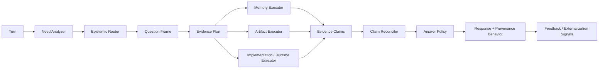

# Epistemic Routing - Memory, Artifacts, and Decision Reconciliation

> Status: partially implemented — route_question + artifact bootstrap shipped; reconciliation strengthening gated behind rework


## Status: Core routing, artifact bootstrap, runtime inspection, and reconciliation shipped

What is implemented now:

- deterministic `remember | inspect | reconcile` routing
- bootstrapped `Artifact` entities for key project docs/config/skills
- REST and MCP routing surfaces (`route`, `artifacts/search`, `runtime`)
- knowledge-chat evidence gathering before first answer
- decision/artifact externalization edges in the graph

Still optional / gated:

- graph-level decision semantics only strengthen when `integration_profile=rework`
- MCP workspace-native search remains the exact-code authority

This document addresses a retrieval problem that sits above recall ranking and
below final answer generation:

> When a user asks something that could be answered from personal memory,
> project artifacts, implemented behavior, or some combination of them, how
> should the agent decide what to consult and how to reconcile conflicts?

This is not just a search problem. It is an epistemic routing problem.

It follows:

- [recall-rework.md](./recall-rework.md)
- [natural-need-signals-build.md](./natural-need-signals-build.md)
- [extraction-rework.md](./extraction-rework.md)
- [answer-contract-resolver.md](./answer-contract-resolver.md)

Those documents improve memory usefulness, cue-first projection, and recall
control. This document covers a different gap:

- memory can be correct but incomplete
- the repo can be current but lack provenance
- the user may be asking about historical intent, current truth, or both

That distinction matters.

## Summary

Standard systems flatten all available text into one retrieval pool. That is
not enough here.

The same idea can exist in multiple epistemic states at once:

1. discussed in conversation
2. remembered in Engram
3. documented in a design doc or README
4. implemented in code
5. reflected in current runtime behavior

Those are not interchangeable sources.

For Engram, the core problem is not "search memory and maybe grep the repo."
It is:

1. infer what kind of truth the user is asking for
2. choose the right evidence sources up front
3. reconcile historical intent with current artifacts and behavior
4. answer in a way that preserves both continuity and authority

The proposed design introduces an `epistemic router` with three primary modes:

- `remember`: interpersonal continuity and undocumented context
- `inspect`: artifact-backed current truth
- `reconcile`: combine memory and artifacts for temporal or decision questions

This is the first step toward a system that does not just retrieve facts. It
tracks how facts become official.

## Why This Is A Distinct Problem

The failure mode is easy to miss:

- the model asks Engram only
- Engram returns weak or partial project memory
- the model concludes "I don't know"
- the answer ignores code, docs, or current implementation that are already in
  the workspace

The opposite failure is also bad:

- the model searches only the repo
- it answers from current docs
- it loses the user-specific or historical context behind the decision

Neither failure is solved by stronger keyword recall.

The underlying issue is that the system is treating all retrieved text as if it
had the same meaning and authority.

It does not.

## Goals

1. Distinguish personal continuity from artifact-backed truth.
2. Handle questions about prior decisions without losing current reality.
3. Avoid saying "I don't know" when one source is weak but another is likely
   authoritative.
4. Preserve provenance: what we discussed, what we documented, what we
   implemented, and what is true now are different things.
5. Fit this into the existing recall rework instead of replacing it.

## Non-Goals

1. Replacing Engram's retrieval scorer.
2. Treating the repo as just another memory store.
3. Requiring an LLM-heavy orchestration layer on every turn.
4. Solving general truth arbitration on the open web.
5. Forcing all surfaces to have artifact access; some surfaces will remain
   memory-only.

## Core Insight

The problem is not multi-source retrieval.

The problem is source authority over time.

For a question like:

> "I can't remember what we decided in terms of launching Engram to the public"

the user may implicitly be asking three different things:

1. what did we discuss before?
2. what was the actual decision?
3. what is reflected in the current repo and product posture now?

Those are related but not identical.

The system should not collapse them into one generic recall query.

## Key Concepts

### 1. Source Type

The router should reason about evidence sources explicitly.

Initial source types:

- `memory`
  - Engram episodes, entities, relationships, intentions, packets
- `artifact`
  - README, docs, design docs, skill definitions, config files
- `implementation`
  - current code and shipped defaults
- `runtime`
  - live server state, config, stats, actual enabled behavior

Not every surface can access every source type. That is fine. The planner
should know the available tools for the current surface.

### 2. Authority Type

Each source contributes a different kind of authority:

- `personal_continuity`
  - what a person who knows the user should remember
- `historical_intent`
  - what was discussed, decided, or preferred at the time
- `documented_policy`
  - what the docs or design artifacts say
- `implemented_behavior`
  - what the code actually does
- `live_state`
  - what is true in the running system right now

These are not a single confidence axis. A low-confidence memory can still be
the best source for continuity, while code is the best source for current
behavior.

### 3. Externalization State

The system should eventually model how an idea becomes official.

Suggested ladder:

1. `mentioned`
2. `discussed`
3. `decided`
4. `documented`
5. `implemented`
6. `announced`
7. `superseded`

Not every fact will move through every stage, but project decisions often do.

This is the deeper opportunity: Engram should not only remember facts. It
should remember the transition from tacit memory to explicit artifact.

### 4. Question Mode

The router should classify the user's turn into one of three high-level modes:

- `remember`
  - best answered from Engram
- `inspect`
  - best answered from artifacts, implementation, or runtime state
- `reconcile`
  - requires both historical memory and current artifacts

This is the real decision point. Retrieval should follow from this mode, not
replace it.

## Hidden Questions The Router Should Answer

Before retrieval, the system should silently answer:

1. Is this primarily about interpersonal continuity?
2. Should a canonical artifact probably exist?
3. Is the user asking about historical intent, current truth, or both?
4. Is the current project/workspace likely the domain of the answer?
5. Would a repo-only answer lose important provenance?
6. Would a memory-only answer risk being outdated or unofficial?

Those hidden questions are a better control surface than "did the user ask for
memory?"

## Routing Modes

### Mode A: Remember

Use when the question is mainly about personal continuity or undocumented
context.

Examples:

- "my son did great today"
- "talked to Sarah about it"
- "still dealing with that bug"
- "he had a great game today"

Preferred sources:

1. memory
2. runtime/artifact only if memory is weak and the surface supports it

Primary value:

- continuity
- resolution of omitted referents
- project/person state that the user assumes is shared

### Mode B: Inspect

Use when the question is mainly about artifact-backed current truth.

Examples:

- "how do we install the OpenClaw skill?"
- "is full mode rework by default?"
- "what env vars enable natural recall?"

Preferred sources:

1. implementation
2. artifact
3. runtime
4. memory only as optional provenance

Primary value:

- current truth
- exact instructions
- authoritative project state

### Mode C: Reconcile

Use when the question is about a decision, plan, strategy, or historical
intent that may now be reflected in artifacts or implementation.

Examples:

- "what did we decide about launching Engram publicly?"
- "what was the call on full mode versus rework?"
- "did we ever agree to ship this through OpenClaw?"
- "why did we end up doing it this way?"

Preferred sources:

1. memory
2. artifact
3. implementation
4. runtime, when relevant

Primary value:

- explain both provenance and current manifestation
- detect disagreement between remembered discussion and current repo truth
- avoid false certainty from either source alone

## Target Architecture



This sits above recall ranking. It does not replace the existing retrieval
pipeline. It decides which pipelines should run.

## Proposed Data Shapes

### Question Frame

```python
@dataclass
class QuestionFrame:
    mode: Literal["remember", "inspect", "reconcile"]
    domain: str  # personal, project, product, runtime, etc.
    timeframe: Literal["historical", "current", "both"]
    expected_authorities: list[str]
    expected_sources: list[str]
    requires_workspace: bool = False
    confidence: float = 0.0
```

### Evidence Claim

```python
@dataclass
class EvidenceClaim:
    subject: str
    predicate: str
    object: str
    source_type: str
    authority_type: str
    externalization_state: str | None = None
    timestamp: datetime | None = None
    confidence: float = 0.0
    provenance: str | None = None
```

### Evidence Plan

```python
@dataclass
class EvidencePlan:
    question_frame: QuestionFrame
    use_memory: bool
    use_artifacts: bool
    use_implementation: bool
    use_runtime: bool
    memory_budget: int = 3
    artifact_budget: int = 3
    implementation_budget: int = 2
```

The point is not the exact schema. The point is to stop treating all retrieval
as one undifferentiated query.

## Reconciliation Rules

The answer policy should depend on what kind of truth the user is asking for.

### 1. Personal continuity

Precedence:

1. memory
2. current user turn
3. artifacts only if obviously relevant

Behavior:

- answer naturally
- do not over-explain provenance
- prefer continuity over artifact exhaustiveness

### 2. Current project truth

Precedence:

1. implementation
2. runtime
3. documented artifacts
4. memory as historical context only

Behavior:

- answer from the authoritative current source
- optionally mention that earlier discussion differed

### 3. Past decision with current manifestation

Precedence:

1. reconcile memory and artifacts
2. if they agree, answer directly
3. if artifacts exist but memory is weak, say the repo currently reflects X
4. if memory exists but no artifact exists, say we discussed X but it is not
   clearly codified
5. if they conflict, describe the transition: earlier we discussed X, current
   docs/code reflect Y

This is the most important rule in the document.

The system should not collapse a conflict into one blended answer. It should
preserve the temporal distinction.

## Relationship To Existing Recall Rework

This should extend the recall rework, not replace it.

Recommended layering:

1. `MemoryNeed` remains the recall gate for Engram-specific retrieval.
2. New `QuestionFrame` / `EvidencePlan` logic sits above it.
3. The recall planner becomes one executor inside a larger evidence plan.
4. Packet assembly stays intact for memory evidence.
5. Artifact and implementation evidence get their own normalized claim shape.

In other words:

- recall rework answers "what memory should I fetch?"
- epistemic routing answers "should I fetch memory, artifacts, implementation,
  or some combination?"

That keeps the current rework modular.

## Relationship To Extraction Rework

The extraction rework introduced cue-first progressive memory. That remains
correct.

This document adds one new strategic idea:

- when a project decision becomes documented or implemented, the system should
  eventually record that externalization step

Possible future edges:

- `DECIDED_IN`
- `DOCUMENTED_IN`
- `IMPLEMENTED_BY`
- `ANNOUNCED_AS`
- `SUPERSEDED_BY`

That would let Engram answer not just "what is true?" but:

- when did this become official?
- where was it codified?
- what replaced the earlier plan?

## Example Walkthroughs

### Example 1: Personal continuity

Input:

> "my son did great today in soccer"

Frame:

- mode: `remember`
- timeframe: `current`
- expected authority: `personal_continuity`

Plan:

- recall from memory
- no repo search required

Desired answer:

- resolve "my son" to `Ovando`
- answer naturally
- then observe/store the new update

### Example 2: Artifact-backed current truth

Input:

> "how do we install the OpenClaw skill?"

Frame:

- mode: `inspect`
- timeframe: `current`
- expected authority: `documented_policy`, `implemented_behavior`

Plan:

- search README
- inspect `skills/engram-memory/SKILL.md`
- memory optional

Desired answer:

- answer from docs and skill definition
- no need to consult Engram first

### Example 3: Decision reconciliation

Input:

> "I can't remember what we decided in terms of launching Engram to the public"

Frame:

- mode: `reconcile`
- timeframe: `both`
- expected authority: `historical_intent`, `documented_policy`

Plan:

1. recall prior discussions about launch, distribution, and OpenClaw
2. inspect repo/docs for public-launch manifestations
3. reconcile results

Desired answer:

- if memory says "OpenClaw was the likely distribution target"
- and the repo now contains a documented OpenClaw skill
- answer:
  - we discussed OpenClaw as the likely public distribution path
  - the repo now reflects that via the OpenClaw skill/integration
  - I do not see a more formal launch strategy document beyond that

That answer is better than either source alone.

## Initial Heuristic Router

The first implementation does not need a model.

### `remember` bias signals

- possessive or relational references
- pronouns with likely omitted referent
- continuation markers
- personal-state language

### `inspect` bias signals

- "how do we"
- "where is"
- "what env"
- "is this enabled"
- "what does the repo/docs/code say"
- install/configuration questions

### `reconcile` bias signals

- "what did we decide"
- "what was the plan"
- "did we ever agree"
- "why did we do this"
- "what were we going to"
- "ring any bells"
- decision / launch / roadmap / integration / strategy language in the active
  project

The current project/workspace should be a strong prior for `inspect` and
`reconcile`.

## Surface-Specific Behavior

### MCP / coding agents

Strongest fit for this design.

Available evidence sources:

- Engram memory
- workspace search
- file reads
- implementation inspection
- optional runtime state

This is where `reconcile` should be first-class.

### REST knowledge chat

More limited.

Available evidence sources:

- Engram memory
- runtime state
- possibly project bootstrap or attached docs later

This surface can still use the same frame, but artifact access may be absent.

### OpenClaw skill

Likely starts simpler:

- memory first
- explicit docs or local file inspection when available

The important point is that the same routing concepts should still apply even
if the available executors differ.

## Rollout Phases

### Phase 0: Prompt and policy hardening

Goal:

- stop memory-only or repo-only false conclusions on obvious project-decision
  turns

Work:

- strengthen MCP/OpenClaw prompts to treat project decision questions as
  hybrid retrieval
- add guidance to consult both memory and workspace artifacts before saying "I
  don't know"

This is the cheapest immediate improvement.

### Phase 1: Heuristic question framing

Goal:

- classify `remember` / `inspect` / `reconcile` deterministically

Work:

- add a lightweight frame builder above `MemoryNeed`
- feed current workspace/project name into routing
- surface frame/debug telemetry

### Phase 2: Evidence planning and source executors

Goal:

- move from ad hoc fallback behavior to planned multi-source retrieval

Work:

- introduce `EvidencePlan`
- memory executor uses the recall planner
- artifact executor uses workspace search/read tools
- implementation executor checks code/config/runtime when relevant

### Phase 3: Claim reconciliation

Goal:

- normalize evidence from different sources and reconcile conflicts explicitly

Work:

- add a common `EvidenceClaim` shape
- define authority-aware merge and conflict rules
- teach answer policy to distinguish historical intent from current truth

### Phase 4: Externalization tracking

Goal:

- let Engram remember not just facts, but how facts became official

Work:

- add artifact/document entities and externalization edges
- track transitions from discussed -> documented -> implemented -> superseded
- make those transitions recallable

This is the truly novel long-term direction.

## Metrics

### Routing quality

- mode accuracy: did the system choose `remember`, `inspect`, or `reconcile`
  correctly?
- false memory-only answers on project-decision questions
- false artifact-only answers on continuity questions

### Reconciliation quality

- conflict detection rate
- rate of "artifact exists but memory was weak"
- rate of "memory exists but no codified artifact"
- rate of explicit temporal distinction in final answers

### Outcome quality

- fewer generic answers when one relevant source existed
- fewer incorrect "I don't know" answers
- higher user-rated trust on project decision questions

## Failure Modes

### 1. Everything becomes `reconcile`

This would be expensive and noisy.

Mitigation:

- keep routing explicit and conservative
- default to `remember` for personal continuity
- default to `inspect` for exact how-to / config / implementation questions

### 2. Artifacts overrule memory too aggressively

This loses continuity and provenance.

Mitigation:

- only artifact-first when the user is asking for current truth
- preserve historical memory in the answer when it matters

### 3. Memory overrules current implementation

This creates stale-confidence failures.

Mitigation:

- implementation/runtime must win for "what is true now?" questions

### 4. Conflict explanations become verbose or robotic

Mitigation:

- keep internal reconciliation structured
- keep user-facing answers concise unless the conflict is material

## Summary

The novel problem here is not "how do we combine recall and grep?"

It is:

> how should an agent reason when the same idea exists as conversation,
> personal memory, documentation, code, and live behavior, each with different
> authority?

The proposed answer is epistemic routing:

1. classify the kind of truth the user wants
2. plan the right evidence sources
3. reconcile historical intent with current artifacts
4. preserve provenance instead of flattening everything into one retrieval pool

That is a more serious path than bolting on repo fallback, and it matches the
kind of memory system Engram is trying to become.
