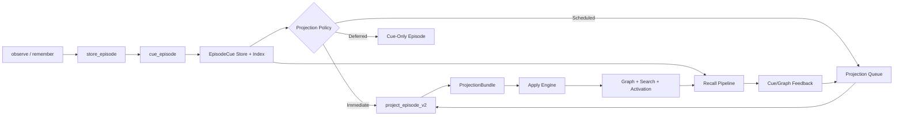

# Extraction Rework — Progressive Projection and Cue-First Memory

## Status: Proposed Build Path

This document proposes a rework of Engram's extraction pipeline.

The recommendation is not a ground-up rewrite. The CQRS split is correct:

- `observe()` / `store_episode()` should stay cheap
- `remember()` / `project_episode()` should stay capable
- consolidation should continue refining durable structure offline

What is missing is a middle layer between raw episodes and fully projected
graph facts.

Today the system is effectively binary:

1. raw episode text exists
2. or full graph projection exists

That is too coarse for a memory system whose real goal is recall usefulness.

The proposed rework adds a third state:

3. cue-backed latent memory that is recallable before full projection

This is the core idea behind the redesign.

## Summary

The current extraction stack is directionally strong, but it is carrying too
many jobs in one place:

- deciding what is worth projecting
- calling the extractor
- resolving entities
- applying relationship semantics
- indexing
- activating
- triggering downstream systems

The result is a fragile jump from raw capture to durable graph structure.

The proposed system changes that to:

1. store the episode
2. generate deterministic retrieval cues immediately
3. make the cue recallable right away
4. project only when policy or demand justifies the cost
5. apply extracted facts through a smaller, typed projection pipeline

This gives Engram a progressive memory substrate:

- cheap capture remains cheap
- observe becomes more genuinely useful
- recall can use latent memories before graph projection
- full projection becomes more targeted and more reliable

## Why Rework Extraction

The current extraction side has five structural problems.

### 1. The projector is overloaded

`GraphManager.project_episode()` currently mixes:

- extraction
- entity resolution
- relationship application
- reconsolidation
- surprise detection
- prospective memory checks
- indexing
- activation
- event publication

That makes correctness harder to reason about and harder to evolve.

### 2. Cheap capture is weaker than it looks

`observe()` stores raw episodes cheaply, but in practice the system still
depends heavily on full projection before that memory becomes broadly useful.

In SQLite-only mode, raw episodes remain FTS-searchable through triggers. In
hybrid mode, vector recall quality is materially better only after projection.

So `observe()` is cheap, but not consistently first-class.

### 3. Extraction failure can silently degrade memory quality

The current extractor returns empty entity and relationship lists on model or
JSON errors instead of surfacing a typed failure. That makes some failures look
like successful zero-yield projections.

For a memory system, silent failure is worse than explicit failure. It creates
false confidence that knowledge was incorporated when it was not.

### 4. The triage layer is not yet a real learning system

The multi-signal scorer is directionally good, but at least two parts are
currently inert or underutilized:

- embedding surprise is not wired into the live path
- outcome calibration is not clearly feeding back from production outcomes

That means the system still makes extract/defer/skip decisions with less signal
than its interface suggests.

### 5. Recall has no latent memory substrate

This is the most important issue.

When an episode is not fully projected, Engram has very limited ways to use it.
That turns many observed episodes into dark storage:

- present in the store
- not yet translated into graph facts
- weakly usable during recall

The memory system needs a middle state that is:

- cheaper than full projection
- more usable than raw text
- designed around retrieval, not around perfect extraction

## Goals

1. Keep `observe()` cheap while making it materially more useful.
2. Add a middle memory state that supports retrieval before full projection.
3. Split projection into smaller, typed stages with clearer contracts.
4. Make extraction failures explicit, retryable, and measurable.
5. Project on demand when recall evidence says an episode matters.
6. Preserve existing graph and consolidation investments.
7. Keep the hot path mostly deterministic and cheap by default.

## Non-Goals

1. Replacing Engram's graph model.
2. Replacing consolidation phases.
3. Rewriting recall ranking from scratch.
4. Making the ingestion hot path LLM-heavy by default.
5. Eliminating `remember()` as an explicit fast-track for important memories.

## Design Principles

1. Retrieval utility before structural completeness. A memory that can help
   recall now is better than a perfect graph fact that arrives too late.
2. Progressive projection over binary projection. Memory should mature in
   stages.
3. Deterministic first pass, model second pass. Cheap cues should be generated
   without an LLM.
4. Typed intermediates over giant orchestration functions. Each stage should
   have a narrow contract.
5. Demand should shape projection. Repeated recall pressure is a strong signal
   that an episode deserves deeper work.
6. Failure should be explicit. Silent no-op projection is not acceptable.
7. Recall and extraction should share feedback. Misses, hits, and near-misses
   should inform what gets projected next.

## Core Idea: Progressive Projection

The proposed architecture introduces a new concept:

- `EpisodeCue`

An `EpisodeCue` is a deterministic, retrieval-oriented representation of an
episode. It is not a graph fact and not a final extraction result. It is a
compact memory trace that can support recall and routing before full
projection.

An episode can now move through these states:

```text
stored -> cued -> projected
             \-> cue_only
             \-> scheduled_for_projection
             \-> failed / dead_letter
```

This creates three usable memory layers:

1. `Raw Episode`
   Stored text with source and timestamps.

2. `Cue Memory`
   Deterministic retrieval cues, embeddings, salience, mention spans, and
   projection priority.

3. `Graph Memory`
   Extracted entities, relationships, summaries, and consolidated structure.

That middle layer is the main redesign.

## Target Architecture



## Proposed Components

### 1. Cue Generator

New module:

- `server/engram/extraction/cues.py`

Responsibilities:

- classify discourse as `world`, `hybrid`, or `system`
- compute emotional salience and self-reference signals
- extract cheap surface cues without an LLM
- build a compact `cue_text` for search and vector indexing
- assign a projection priority and policy reason

Inputs:

- episode content
- source
- session id
- current config

Outputs:

- `EpisodeCue`

Initial cue extraction should be deterministic and low-latency.

Suggested cue fields:

- proper-name mentions
- technical token mentions
- quoted phrases
- time expressions
- URLs / file paths / package names
- numbers with units
- contradiction hints
- identity hints
- open-loop hints such as TODO, later, remind, need to, follow up
- first two salient spans

### 2. Cue Store

New storage abstraction:

- `EpisodeCueStore`

This can live beside the graph store rather than inside it conceptually, even
if SQLite physically stores it in the same database.

Suggested schema for v1:

```text
episode_cues
  episode_id              TEXT PRIMARY KEY
  group_id                TEXT NOT NULL
  cue_version             INTEGER NOT NULL
  discourse_class         TEXT NOT NULL
  projection_state        TEXT NOT NULL
  cue_score               REAL NOT NULL
  salience_score          REAL NOT NULL
  projection_priority     REAL NOT NULL
  route_reason            TEXT
  cue_text                TEXT NOT NULL
  entity_mentions_json    TEXT NOT NULL
  temporal_markers_json   TEXT NOT NULL
  quote_spans_json        TEXT NOT NULL
  contradiction_keys_json TEXT NOT NULL
  first_spans_json        TEXT NOT NULL
  hit_count               INTEGER NOT NULL DEFAULT 0
  projection_attempts     INTEGER NOT NULL DEFAULT 0
  last_hit_at             DATETIME
  last_projected_at       DATETIME
  created_at              DATETIME NOT NULL
  updated_at              DATETIME NOT NULL
```

Recommended episode table additions:

```text
episodes
  projection_state        TEXT DEFAULT 'queued'
  last_projection_reason  TEXT
  last_projected_at       DATETIME
  projection_attempts     INTEGER DEFAULT 0
```

### 3. Cue Indexing

New search/index capability:

- `index_episode_cue()`
- `search_episode_cues()`

Implementation guidance:

- in SQLite mode, create an FTS index over `cue_text`
- in hybrid mode, store a vector embedding for `cue_text`
- keep raw episode search as-is
- add cue search as a distinct candidate source

This is important. The cue should usually be embedded and searched as a denser,
cleaner representation than the full raw episode.

That is how `observe()` becomes a better recall substrate without paying full
projection cost.

### 4. Projection Policy

New module:

- `server/engram/extraction/policy.py`

Responsibilities:

- decide `project_now`, `cue_only`, or `schedule_projection`
- use cheap deterministic signals
- accept feedback from recall and consolidation pressure

Suggested policy inputs:

- cue score
- salience score
- discourse class
- source type
- `remember` vs `observe`
- contradiction hints
- identity hints
- prospective/open-loop hints
- repeated cue hits
- recent recall misses / near-misses

Suggested initial policy rules:

- `remember()` always `project_now`
- explicit corrections always `project_now`
- identity-core or contradiction cues usually `project_now`
- high-salience personal content usually `project_now`
- low-value/system content becomes `cue_only` or `skip`
- medium-value content becomes `schedule_projection`
- any cue with repeated recall hits escalates to `schedule_projection`

### 5. Projection Planner

New module:

- `server/engram/extraction/planner.py`

Responsibilities:

- decide what span(s) of an episode to project
- prioritize cue spans before full-text projection
- support segmentation for long episodes

This is a major improvement over the current hard truncation path.

For long content, do not send a blind first-8000-char slice to the extractor.
Instead:

1. segment the episode into spans
2. rank spans using cue density and salience
3. project top spans first
4. expand to neighboring spans if needed

This lets late-turn corrections and high-information snippets survive.

### 6. ProjectionBundle

New typed intermediate model:

- `server/engram/extraction/models.py`

Suggested types:

```python
class ProjectionBundle:
    episode_id: str
    spans: list[ProjectedSpan]
    entities: list[EntityCandidate]
    claims: list[ClaimCandidate]
    warnings: list[str]
    extractor_status: str

class ClaimCandidate:
    subject_text: str
    predicate: str
    object_text: str | None
    object_value: dict | None
    polarity: str
    temporal_hint: str | None
    confidence: float
    source_span_id: str
```

This bundle is the handoff point between extraction and application.

It gives you a place to:

- validate extractor output
- normalize names and predicates
- attach span provenance
- reject malformed or low-confidence claims
- retry extraction without duplicating write logic

### 7. Apply Engine

New module:

- `server/engram/extraction/apply.py`

Responsibilities:

- resolve entity candidates
- apply entity updates
- apply relationship semantics
- record provenance
- return structured apply statistics

This should absorb logic currently embedded inside `project_episode()`.

The core rule is simple:

all fact-writing semantics should go through one path.

That path should be reused by:

- ingestion projection
- replay
- targeted re-projection
- future correction flows

### 8. Feedback Loop

Recall should now inform extraction directly.

New signals:

- cue retrieved and used
- cue retrieved but insufficient
- cue near-miss
- explicit recall miss followed by `remember`
- repeated cue hits within a short window

These signals should update:

- cue hit counters
- projection priority
- projection queue
- routing thresholds over time

This is the key loop that makes projection demand-shaped rather than purely
ingestion-shaped.

## Hot Path Changes

### `observe()` path

Current:

```text
observe -> store_episode -> worker/triage maybe project later
```

Proposed:

```text
observe
  -> store_episode
  -> cue_episode
  -> index_episode_cue
  -> projection_policy
  -> cue_only | schedule_projection | project_now
```

Expected result:

- episode becomes recallable immediately through cue search
- full extraction is deferred unless policy or demand justifies it

### `remember()` path

Current:

```text
remember -> ingest_episode -> project_episode
```

Proposed:

```text
remember
  -> store_episode
  -> cue_episode
  -> project_now
  -> project_episode_v2
```

`remember()` should still be the strong signal path. The cue is still useful
for observability, segmentation, and consistent indexing, but not as a
replacement for immediate projection.

## Recall Integration

This rework is extraction-side, but it exists to improve recall.

Recall should search three candidate surfaces:

1. graph entities and facts
2. projected episodes
3. cue-backed latent episodes

Cue-backed results should be surfaced differently from graph facts.

Suggested cue recall payload:

```json
{
  "result_type": "cue_episode",
  "episode_id": "ep_123",
  "cue_text": "Alex discussing extraction redesign, progressive projection, recall utility",
  "supporting_spans": [
    "What good is storing all the data if the AI agent never uses it?"
  ],
  "projection_state": "cue_only",
  "score": 0.72
}
```

If cue recall is strong but graph support is weak, Engram should:

- surface the cue now
- enqueue targeted projection in the background

That is the main behavioral shift.

## Worker and Triage Role

The worker and triage phases should change role under this design.

Today they mostly answer:

- should this episode be extracted now, later, or never

Under progressive projection, cue generation happens before that question.

Their new jobs become:

### Worker

- execute immediate projection jobs
- execute scheduled targeted projection jobs
- merge adjacent auto-captured turns before cue generation or before projection,
  depending on source type
- maintain cooldowns and retry policy

The worker should stop being the first component that makes an episode useful.
The cue layer takes that job.

### Triage

- operate over `cue_only` and `scheduled` episodes rather than raw `queued` only
- use cue metadata as input features
- select which latent memories deserve deeper projection under batch pressure
- escalate repeated recall-hit episodes even if their original cue score was moderate

This makes triage closer to a projection scheduler than a binary extract gate.

## API and Event Changes

The external tool shape can stay mostly stable.

### MCP / REST

`observe()` and `remember()` should remain backward-compatible. Optional new
fields can be added:

- `projection_state`
- `cue_score`
- `route_reason`

These are useful for debugging and dashboard surfaces, but they do not need to
be shown to end users by default.

### Events

Recommended new events:

- `episode.cued`
- `episode.projection_scheduled`
- `episode.projection_started`
- `episode.projected`
- `episode.projection_failed`
- `cue.hit`
- `cue.promoted`

These events should feed:

- dashboard observability
- projection metrics
- consolidation pressure
- recall feedback loops

## Current Code Restructuring

### Keep

- `store_episode()`
- `ingest_episode()` as a convenience wrapper
- `remember()` vs `observe()` distinction
- triage as a policy layer
- consolidation as downstream refinement

### Shrink

- `GraphManager.project_episode()`

It should become orchestration only:

1. load episode and cue
2. call planner
3. call projector
4. call apply engine
5. run post-apply hooks

### Introduce

- `CueGenerator`
- `CueStore`
- `ProjectionPolicy`
- `ProjectionPlanner`
- `Projector`
- `ApplyEngine`
- `ProjectionResult`

Recommended new files:

- `server/engram/extraction/cues.py`
- `server/engram/extraction/policy.py`
- `server/engram/extraction/planner.py`
- `server/engram/extraction/projector.py`
- `server/engram/extraction/apply.py`
- `server/engram/extraction/models.py`
- `server/engram/storage/.../cue_store.py`

## Failure Semantics

This should be fixed before or during the redesign.

### Extractor contract

The extractor should return a typed result:

```python
class ExtractorStatus(Enum):
    OK = "ok"
    EMPTY = "empty"
    PARSE_ERROR = "parse_error"
    API_ERROR = "api_error"
    TRUNCATED = "truncated"
```

And:

- parse/API errors must not be flattened into `entities=[]`
- content hashes should not be committed before successful projection
- failed projections should increment attempt counts
- retry vs dead-letter should be explicit

### Episode status model

Suggested projection states:

- `queued`
- `cued`
- `cue_only`
- `scheduled`
- `projecting`
- `projected`
- `failed`
- `dead_letter`

This is clearer than treating everything as generic episode completion.

## Concrete Rollout Plan

## Phase 0: Reliability Hardening

Do this first.

Changes:

1. make extractor failures typed
2. stop treating parse/API failure as successful zero-yield extraction
3. only add dedup hash after successful projection commit
4. add projection attempt counting and failure metrics
5. add tests for retryable vs terminal failures

Acceptance criteria:

- no silent extractor failures
- failed projections are visible in episode state
- retries can be triggered without duplicate suppression bugs

## Phase 1: Cue Layer

Changes:

1. add `EpisodeCue` model and storage
2. generate cues in `store_episode()`
3. add `index_episode_cue()` and `search_episode_cues()`
4. compute deterministic projection policy at cue time
5. keep existing `project_episode()` for actual full projection

Acceptance criteria:

- every observed episode gets a cue unless discourse is pure system noise
- cue generation is deterministic and low-latency
- cue search returns useful results for recent observed episodes

## Phase 2: Cue-Aware Recall

Changes:

1. add cue candidate source to retrieval
2. return cue-backed results distinctly from graph facts
3. increment cue hit counters on retrieval
4. enqueue targeted projection when cue hits exceed threshold

Acceptance criteria:

- observed-but-unprojected episodes can influence recall
- cue hits increase later projection likelihood
- auto-recall can surface cue-backed context

## Phase 3: Targeted Projection

Changes:

1. add `ProjectionPlanner`
2. segment long episodes
3. project cue-dense spans before full episode text
4. support demand-driven re-projection from recall signals

Acceptance criteria:

- long episodes no longer depend on naive front truncation
- late-turn corrections survive more often
- repeated cue hits drive targeted projection jobs

## Phase 4: Projector Refactor

Changes:

1. introduce `ProjectionBundle`
2. move write semantics into `ApplyEngine`
3. make `GraphManager.project_episode()` orchestration-only
4. align replay with the same apply path

Acceptance criteria:

- ingestion and replay share fact-application semantics
- projector logic is split into testable units
- graph write behavior is easier to audit

## Phase 5: Policy Learning

Changes:

1. use cue hit/use signals to calibrate projection policy
2. incorporate recall misses and near-misses
3. tune projection thresholds per source or content class

Acceptance criteria:

- policy becomes more selective without reducing recall usefulness
- high-value cue-only episodes get projected more consistently

## Metrics

The redesign should be judged by memory usefulness, not just extraction yield.

Recommended metrics:

- cue coverage
  - percent of stored episodes with generated cues
- cue retrieval hit rate
  - percent of recall sessions where cue results appear
- cue-to-projection conversion rate
  - percent of cue-only episodes later promoted to full projection
- time to first usable memory
  - from observe call to first recallable cue or graph fact
- projection yield
  - entities, claims, and accepted relationships per projected episode
- silent failure rate
  - should trend to zero
- long-episode salvage rate
  - percent of relevant late spans retained in projection
- recall uplift
  - how often cue-backed or newly projected memory affects the next response or tool action

## Migration Strategy

1. ship schema changes behind flags
2. enable cue generation first for new episodes only
3. backfill cues for recent episodes in batches
4. enable cue-aware recall behind a config gate
5. switch worker policy from direct project/skip to cue-first routing
6. refactor projector only after cue layer is stable

Recommended flags:

- These are extraction-only rollout flags. They do not activate the full
  extraction + recall + consolidation loop on their own.
- For coherent full-loop behavior, use `integration_profile=rework` and treat
  the flags below as subsystem overrides.

- `cue_layer_enabled`
- `cue_vector_index_enabled`
- `cue_recall_enabled`
- `targeted_projection_enabled`
- `projector_v2_enabled`

## Risks and Mitigations

### Risk: cue quality is too shallow

Mitigation:

- keep raw episode fallback
- store cue provenance spans
- tune cue text construction with offline evals

### Risk: cue search adds noise to recall

Mitigation:

- return cue results as a separate candidate class
- discount their rank relative to durable graph facts
- require stronger thresholds before automatic surfacing

### Risk: more states make operations harder to follow

Mitigation:

- use explicit projection states
- add event logs for cue generation, projection scheduling, and projection completion
- expose cue stats in the dashboard and APIs

### Risk: projection demand loop can thrash

Mitigation:

- cooldowns on requeue
- cap projection attempts
- require repeated hits or strong miss signals before escalation

## Open Questions

1. Should cue embeddings store the raw episode text, cue text, or both?
   Recommendation: cue text first, raw text optional later.
2. Should cue-backed episodes contribute to activation?
   Recommendation: track cue hits separately from entity access until the episode is projected.
3. Should all `remember()` calls still fully project synchronously?
   Recommendation: yes for now.
4. Should cue storage live inside graph stores or behind a parallel protocol?
   Recommendation: parallel protocol with per-store implementations.

## Recommendation

Do not do a total rework of extraction.

Do this instead:

1. harden failure semantics
2. add a cue-backed latent memory layer
3. make recall able to use cues before full projection
4. let recall demand drive targeted projection
5. refactor the projector into typed stages after the cue layer proves out

That preserves the good parts of the current architecture while fixing the main
structural gap:

Engram needs memory that is usable before it is fully canonical.
