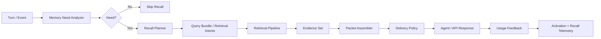

# Recall Rework — Arbitration, Memory Packets, and Usage Feedback

> Status: implemented behind integration_profile=rework — memory packets + usage feedback off by consumer default


## Status: Proposed Build Path

This document is the next-stage recall design for Engram.

It assumes the current wave system already exists:

- Wave 1: AutoRecall
- Wave 2: Conversation awareness
- Wave 3: Proactive retrieval features
- Wave 4: Prospective memory

Those waves improved retrieval mechanics. They do not fully solve the harder problem:

> How does the agent know when memory is needed, what kind of memory to fetch,
> how much to surface, and whether the surfaced memory was actually useful?

That is the focus of this rework.

## Summary

Engram's current recall stack is strong at ranking once a query exists. The remaining gap is not primarily "better search." It is recall control.

Today the system still behaves roughly like:

1. Something happens
2. Synthesize one query
3. Retrieve entities
4. Hope the model uses them

The proposed system changes that to:

1. Detect whether the current turn needs memory
2. Classify what kind of memory is needed
3. Build a small recall plan with multiple retrieval intents
4. Retrieve evidence
5. Assemble answer-ready memory packets
6. Deliver the packets through the right surface
7. Record whether memory was merely surfaced or actually used

This gives Engram a recall loop that can improve over time without reinforcing passive or irrelevant recall.

## Why Rework Recall

Current recall is limited by five structural issues:

1. Recall is still query-first, not need-first.
2. Auto-recall surfaces thin entity summaries, not answer-ready memory.
3. Passive surfacing is treated too much like real usage.
4. Conversation context is only partially grounded in the live turn stream.
5. Evaluation mostly measures retrieval ranking, not downstream response improvement.

The result is a familiar failure mode:

- Engram stores valuable memory.
- Retrieval returns plausible entities.
- The agent still does not reliably act more informed.

That is a control problem, not just an IR problem.

## Goals

1. Make recall fire for the right turns, not every turn.
2. Return memory in a form the agent can immediately use.
3. Separate surfaced memory from used memory in activation and feedback.
4. Unify MCP auto-recall, explicit recall, and API chat retrieval behind one recall architecture.
5. Add metrics that measure whether memory improved the next response or tool action.

## Non-Goals

1. Replacing the extraction pipeline.
2. Replacing storage or consolidation.
3. Rebuilding the core retrieval scorer from scratch.
4. Introducing LLM-heavy routing into the hot path by default.

## Design Principles

1. Need before search. Decide whether memory is needed before constructing retrieval queries.
2. Multiple weak cues beat one brittle query. Use a small query bundle, not a single synthesized string.
3. Packets over entities. Return "what matters now" with evidence and provenance.
4. Surface is not usage. Automatic exposure must not count like deliberate recall usage.
5. Conservative by default. Missing memory is less damaging than confident false memory.
6. Shared architecture. MCP, REST chat, and explicit recall should use the same recall planner and packet assembler.

## Target Architecture



## Core Model

### 1. Memory Need Analyzer

This is the new front door to recall.

Input:

- current user turn
- optional assistant draft or tool intent
- session context
- recent conversation turns
- triggered intentions or surprises

Output:

- whether memory is needed
- memory need type
- urgency
- packet budget
- confidence

Initial implementation should be heuristic and deterministic.

Suggested need types:

- `identity`
- `project_state`
- `temporal_update`
- `open_loop`
- `prospective`
- `fact_lookup`
- `broad_context`
- `none`

The analyzer should answer:

- Is the user referencing something ongoing?
- Is there likely prior context required to answer well?
- Is this a follow-up within an existing topic?
- Is an intention or unresolved thread likely relevant?

This replaces the current pattern where auto-recall always tries to derive one lightweight query from raw content.

### 2. Recall Planner

If memory is needed, the planner produces a small bundle of retrieval intents instead of one string query.

Each intent should include:

- `intent_type`
- `query_text`
- `weight`
- `candidate_budget`
- `packet_types`

Example intent types:

- `direct`: entities or exact concepts from the current turn
- `topic`: recent conversation topic
- `temporal`: recency, change, or "what happened last"
- `session_entity`: entities active in this conversation
- `open_loop`: unresolved tasks, pending decisions, contradictions
- `prospective`: intention-triggered retrieval

Important behavior change:

- evidence from multiple intents should accumulate
- planner outputs should not collapse via max-score semantics
- planner should be budgeted aggressively, usually 2-4 intents

### 3. Retrieval Execution

The existing retrieval pipeline stays, but it becomes an execution engine for planner intents rather than the whole recall policy.

Required changes:

1. Execute retrieval per intent and merge evidence additively.
2. Preserve a trace of where evidence came from.
3. Support abstention when combined evidence is below a calibrated threshold.
4. Distinguish retrieval modes:
   - `auto_surface`
   - `explicit_recall`
   - `context_bootstrap`
   - `chat_tool_use`

The merged candidate should retain:

- semantic score
- activation score
- spreading score
- planner-intent support
- provenance
- confidence band

### 4. Memory Packet Assembler

This is the second major shift.

The agent should not primarily receive "top entities." It should receive packets shaped for action.

Packet types:

- `fact_packet`
  - stable user fact or relationship
- `state_packet`
  - current state of a project, person, or effort
- `timeline_packet`
  - recent changes or temporal sequence
- `open_loop_packet`
  - unresolved item, pending task, contradiction, or decision gap
- `intention_packet`
  - prospective memory trigger
- `episode_packet`
  - raw supporting episode when abstraction is insufficient

Each packet should contain:

- `packet_type`
- `title`
- `summary`
- `why_now`
- `confidence`
- `evidence`
- `provenance`

Minimal packet schema:

```python
@dataclass
class MemoryPacket:
    packet_type: str
    title: str
    summary: str
    why_now: str
    confidence: float
    entity_ids: list[str]
    relationship_ids: list[str]
    episode_ids: list[str]
    evidence_lines: list[str]
```

The packet assembler should favor the smallest packet that answers the likely need.

Examples:

- If the user says "how's the auth migration going?", the best output is a `state_packet`, not five auth-related entities.
- If the user says "did we decide on the Redis thing?", the best output is an `open_loop_packet` or `timeline_packet`.
- If the user mentions a trigger topic, the best output is an `intention_packet`, not the `Intention` entity itself.

### 5. Delivery Policy

Different surfaces need different packet budgets.

#### Auto Surface

Used by `observe()` and `remember()`.

Rules:

- only fire when the analyzer says memory is likely useful
- max 1-2 packets
- prefer `state_packet`, `fact_packet`, or `intention_packet`
- never dump broad context

#### Explicit Recall

Used by direct `recall()` calls.

Rules:

- allow larger packet budget
- return packet summaries plus expandable evidence
- expose near-misses and confidence

#### Context Bootstrap

Used by session start / `get_context()`.

Rules:

- not query-shaped
- assemble a balanced set of identity, active projects, recent activity, and active intentions

#### API Chat Tool Use

Used by `knowledge chat`.

Rules:

- planner can run before tool use, not only after the model decides to call `recall`
- packets should be consumable by both the model and UI

## Activation and Feedback Semantics

This is the most important behavioral correction.

The current system records access during recall. That is valid for explicit recall. It is not automatically valid for auto-surfaced memory.

The new model should distinguish interaction types:

- `surfaced`
- `selected`
- `used`
- `confirmed`
- `dismissed`
- `corrected`

Proposed semantics:

| Interaction | Meaning | Activation effect |
|---|---|---|
| `surfaced` | Memory was shown automatically | none or tiny temporary boost |
| `selected` | Memory was chosen for packet assembly | tiny boost |
| `used` | Agent response or tool choice actually used it | normal access reinforcement |
| `confirmed` | User affirmed it as correct/useful | extra reinforcement |
| `dismissed` | Surfaced but not used / contradicted by better result | no reinforcement |
| `corrected` | User or system marked it wrong | negative feedback / confidence penalty |

Key rule:

> Auto-recall surfacing must not strongly reinforce activation on its own.

That prevents passive echo-chamber behavior.

## Conversation Truth Separation

The system should separate three streams that are currently too entangled:

1. live conversation turns
2. recall queries
3. retrieved memory

Conversation context should be derived from live turns first, not from the generated recall query.

Required changes:

- embed and track actual user/assistant turns when available
- do not let planner-generated queries overwrite or dominate the session fingerprint
- keep session entities sourced from observed or extracted conversation content
- track whether a turn was user-originated, assistant-originated, or recall-generated

## Proposed Modules and File Map

### New Modules

- `server/engram/models/recall.py`
  - `MemoryNeed`
  - `RecallIntent`
  - `RecallPlan`
  - `MemoryPacket`
  - `RecallTrace`
  - `MemoryInteractionEvent`

- `server/engram/retrieval/need.py`
  - heuristic memory-need analyzer

- `server/engram/retrieval/plan.py`
  - build query bundle / retrieval intents

- `server/engram/retrieval/packets.py`
  - packet assembly logic

- `server/engram/retrieval/feedback.py`
  - surfaced/used/confirmed/corrected semantics

### Existing Files To Rework

- `server/engram/graph_manager.py`
  - add planner-driven recall entrypoints
  - split raw retrieval from packet-producing recall
  - record memory interaction type explicitly

- `server/engram/retrieval/pipeline.py`
  - execute multiple planner intents
  - merge evidence additively
  - expose recall trace / abstention

- `server/engram/retrieval/scorer.py`
  - calibrated confidence band
  - abstention threshold support
  - packet-facing score breakdowns

- `server/engram/retrieval/context.py`
  - separate live turn ingestion from recall query ingestion
  - track source of context updates

- `server/engram/mcp/server.py`
  - replace `_extract_recall_query()` hot path with analyzer + planner
  - auto-surface packets instead of thin entity lists

- `server/engram/api/knowledge.py`
  - use shared planner/packet system for chat tool-use loop

- `server/engram/config.py`
  - feature flags for analyzer, packet assembler, interaction semantics, abstention

### Likely Test Files

- `server/tests/test_recall_need.py`
- `server/tests/test_recall_planner.py`
- `server/tests/test_recall_packets.py`
- `server/tests/test_recall_feedback.py`
- `server/tests/test_recall_integration.py`
- `server/tests/test_chat_recall_integration.py`

## New Public Interfaces

### Low-Level

```python
async def retrieve_raw(... ) -> list[ScoredResult]
```

This is the current retrieval engine, kept for benchmarking and lower-level use.

### Planner-Level

```python
async def analyze_memory_need(turn, session_ctx, mode) -> MemoryNeed
async def build_recall_plan(need, turn, session_ctx) -> RecallPlan
async def execute_recall_plan(plan, ...) -> RecallTrace
async def assemble_memory_packets(trace, need, ...) -> list[MemoryPacket]
```

### High-Level

```python
async def recall_for_turn(
    turn: str,
    group_id: str,
    mode: str,  # auto_surface | explicit_recall | bootstrap | chat_tool
) -> RecallOutcome
```

`RecallOutcome` should include:

- `need`
- `plan`
- `packets`
- `near_misses`
- `triggered_intentions`
- `latency_ms`

## Build Phases

### Phase 0: Instrumentation and Guard Rails

Goal:

- measure current recall behavior before changing ranking

Work:

1. Add structured recall telemetry
2. Add interaction types, but initially map current behavior conservatively
3. Add feature flags with default-off semantics

Files:

- `server/engram/models/recall.py`
- `server/engram/retrieval/feedback.py`
- `server/engram/config.py`
- `server/tests/test_recall_feedback.py`

Acceptance:

- explicit recall can still reinforce activation
- auto-recall can be marked `surfaced`
- telemetry is emitted without changing answer content

### Phase 1: Memory Need Analyzer

Goal:

- stop firing recall blindly

Work:

1. Add heuristic memory-need analyzer
2. Integrate it into MCP auto-recall and API chat entrypoints
3. If `need_type=none`, skip recall entirely

Files:

- `server/engram/retrieval/need.py`
- `server/engram/mcp/server.py`
- `server/engram/api/knowledge.py`

Acceptance:

- low-value turns skip auto-recall
- project follow-ups and user references trigger recall
- latency stays within acceptable bounds

### Phase 2: Recall Planner

Goal:

- move from one brittle query to a small query bundle

Work:

1. Add `RecallIntent` and `RecallPlan`
2. Build additive evidence across intents
3. Replace max-score multi-query merge with planner-driven support accumulation

Files:

- `server/engram/retrieval/plan.py`
- `server/engram/retrieval/pipeline.py`
- `server/tests/test_recall_planner.py`

Acceptance:

- multiple cues can strengthen the same candidate
- recall traces show which intents supported each result
- planner budget stays bounded

### Phase 3: Packet Assembly

Goal:

- give the agent usable memory, not just retrieved entities

Work:

1. Add packet models and assembler
2. Implement `fact`, `state`, `timeline`, `open_loop`, and `intention` packets
3. Update MCP/API responses to return packets

Files:

- `server/engram/retrieval/packets.py`
- `server/engram/graph_manager.py`
- `server/engram/mcp/server.py`
- `server/engram/api/knowledge.py`

Acceptance:

- auto-recall returns 1-2 packets max
- explicit recall can return packets plus evidence
- packet output is more directly usable than current entity summaries

### Phase 4: Conversation Truth Separation

Goal:

- ensure conversation awareness is driven by real turns, not recall artifacts

Work:

1. Separate live-turn ingestion from recall-query ingestion
2. Add turn source tracking in `ConversationContext`
3. Embed live turns where possible

Files:

- `server/engram/retrieval/context.py`
- `server/engram/mcp/server.py`
- `server/engram/api/knowledge.py`
- `server/tests/test_conversation_retrieval.py`

Acceptance:

- session fingerprint reflects the conversation
- planner-generated queries do not dominate context state
- topic shift behavior becomes easier to reason about

### Phase 5: Usage-Based Reinforcement

Goal:

- only reinforce memory that actually mattered

Work:

1. Wire `surfaced`, `selected`, `used`, `confirmed`, `corrected`
2. Treat auto-surface as non-reinforcing by default
3. Add optional downstream hooks for response-based usage detection

Files:

- `server/engram/retrieval/feedback.py`
- `server/engram/graph_manager.py`
- `server/engram/api/knowledge.py`
- `server/tests/test_recall_integration.py`

Acceptance:

- auto-recall no longer creates strong passive reinforcement
- explicit recall still behaves as a true access event
- corrected memories can be down-weighted

### Phase 6: Evaluation Harness

Goal:

- prove recall improves agent behavior, not just ranking metrics

Work:

1. Keep existing IR metrics
2. Add session-level task evals
3. Add packet usefulness metrics
4. Extend echo-chamber eval to account for surfaced vs used semantics

Files:

- `server/engram/benchmark/*`
- `server/tests/benchmark/*`

Acceptance:

- measurable lift on session continuity tasks
- reduced passive reinforcement rate
- no major latency regression

## Evaluation Plan

The current benchmark stack is still useful, but insufficient by itself.

### Keep

- Precision@k
- Recall@k
- MRR
- nDCG
- echo-chamber metrics

### Add

- Memory need precision
  - of turns that triggered recall, how many actually benefited

- Useful packet rate
  - percentage of packets that were used in the next model response or tool action

- False recall rate
  - percentage of auto-surfaced packets that were irrelevant or misleading

- Surfaced-to-used ratio
  - how much auto-recall is noise versus actual value

- Session continuity lift
  - improvement on multi-turn tasks requiring prior context

- Open-loop recovery rate
  - how often unresolved decisions/tasks are surfaced at the right moment

- Temporal correctness
  - whether newer facts override stale ones in recall packets

## Rollout Strategy

All major pieces should ship behind feature flags.

Suggested flags:

- These are recall-only rollout flags. Enabling them does not turn on the cue
  layer or projection-promotion path by itself.
- For coherent cross-flow behavior, use `integration_profile=rework` and treat
  the flags below as subsystem overrides.

- `recall_need_analyzer_enabled`
- `recall_packet_assembly_enabled`
- `recall_usage_feedback_enabled`
- `recall_abstention_enabled`
- `recall_plan_multi_intent_enabled`

Recommended rollout order:

1. telemetry only
2. need analyzer in shadow mode
3. planner in shadow mode
4. packets on MCP auto-recall
5. usage feedback semantics
6. API chat integration

## Risks

1. Over-building the planner
   - keep first version heuristic and deterministic

2. Packet assembly becoming a summarization layer that hallucinates
   - packets must stay evidence-backed and source-constrained

3. Latency creep in auto-surface path
   - strict planner budget, strict packet cap

4. Hidden behavior drift across MCP and API chat
   - shared planner and packet assembler, not duplicated logic

5. Reintroducing echo chambers through packet selection
   - surfaced vs used distinction is mandatory

## Open Questions

1. Should packet assembly stay deterministic first, or allow optional LLM synthesis later?
2. How should "used" be detected in chat mode: explicit annotation, heuristic response matching, or tool-linked confirmation?
3. Should open loops be modeled explicitly in storage, or inferred from existing episodes and entities in v1?
4. Should explicit `recall()` expose raw entities, packets, or both?

## Recommendation

Build this in the following order:

1. instrumentation + surfaced-vs-used semantics
2. memory-need analyzer
3. recall planner
4. packet assembly
5. conversation truth separation
6. evaluation harness

Do not start with a new wave.

The next win is not "more retrieval features." It is a recall control layer that decides when memory matters, shapes it into something usable, and only reinforces it when it was actually useful.
