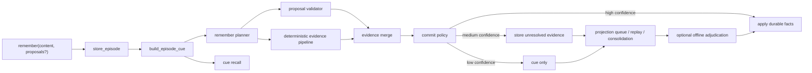

# Remember and EntityExtractor v2

## Status

Proposed design.

This document defines a new architecture for `remember` and
`EntityExtractor.extract()` that reduces live LLM dependence without pretending
that a rule engine can fully replace open-ended semantic extraction.

It is intended to sit on top of the existing CQRS split, cue layer, targeted
projection work, and consolidation phases. It does not replace those systems.

Related docs:

- `docs/design/extraction-rework.md`
- `refined/03_async_ingestion.md`
- `refined/11_memory_consolidation_design.md`

## Executive Summary

The wrong question is:

> How do we get current Haiku extraction quality without an LLM?

The right question is:

> How do we preserve memory quality without requiring an LLM on the hot path?

Those are different problems.

Today, `remember` means:

1. store the episode
2. immediately run a broad semantic extractor
3. treat the extractor output as graph-shaped truth

That design couples "memory capture" to "full semantic understanding right now".
It is expensive, fragile, and unnecessary for a system that already has:

- raw episode storage
- cue-backed latent memory
- demand-shaped projection
- consolidation and replay
- correction and invalidation logic

The proposed design changes the contract:

1. `remember` becomes a priority capture path, not a forced full parser call
2. extraction becomes staged and typed, not monolithic
3. the system commits only high-confidence facts immediately
4. ambiguous structure is stored as evidence, not durable graph truth
5. cue recall, replay, consolidation, and optional offline adjudication can
   promote unresolved evidence later

This gives Engram a new north star:

`LLM-not-required memory quality`

instead of:

`one-shot LLM-equivalent extraction quality`

## Problem Statement

The current `EntityExtractor.extract()` contract asks one component to do all of
the following in a single pass:

- entity detection
- entity typing
- relationship extraction
- predicate normalization
- polarity detection
- temporal interpretation
- PII tagging
- summary generation
- meta-discourse filtering

This is visible in the extraction prompt and output schema.

The downstream apply path then treats the output as semantically meaningful for:

- contradiction invalidation
- exclusive predicate replacement
- negative-polarity invalidation
- temporal validity windows
- durable graph writes

This creates three architectural problems.

### 1. The hot path is too broad

The system pays full semantic parsing cost before it knows whether the episode
actually needs durable graph structure right now.

### 2. The commitment boundary is wrong

The extractor emits graph-ready facts instead of evidence. A mistake in parsing
becomes a mistake in memory structure.

### 3. LLM replacement is framed at the wrong layer

Trying to replace the current extractor with a single deterministic equivalent
inherits the same oversized contract.

That is the failure mode to avoid.

## Design Goals

1. Make `remember` useful without requiring an LLM on the hot path.
2. Preserve graph precision by committing only high-confidence facts.
3. Keep raw and cue memory recallable even when semantic extraction is partial.
4. Reduce the extractor contract to composable stages with narrow semantics.
5. Accept higher recall latency for ambiguous structure without losing the
   underlying memory.
6. Allow capable clients to provide extraction proposals without trusting them
   blindly.
7. Preserve compatibility with the current apply engine, cue layer, and
   consolidation design.
8. Make LLM use optional, explicit, and mostly offline.

## Non-Goals

1. Reproducing full frontier-model extraction quality with regex alone.
2. Eliminating `observe`.
3. Eliminating all LLM use under all deployments.
4. Replacing consolidation, merge, infer, or cue recall.
5. Solving arbitrary coreference and implicit-world-knowledge extraction in the
   live path.

## Core Thesis

Engram should stop treating extraction as:

`text -> final graph facts`

and instead treat it as:

`text -> evidence -> commitable facts + unresolved evidence`

That shift is the main design change.

The system already has a latent-memory substrate through raw episodes and cues.
That means it does not need to force every `remember` event through immediate
open-world semantic parsing.

## Design Principles

### 1. Memory capture and graph commitment are different operations

Every remembered episode should be preserved. Not every remembered episode
should immediately produce durable entities and edges.

### 2. Precision matters more than recall on durable writes

Missing a relationship is cheaper than writing the wrong relationship and then
having downstream retrieval reinforce it.

### 3. Latent memory is first-class

If Engram can recall a cue-backed episode later, then immediate extraction may
be partial without making the system forgetful.

### 4. Deterministic systems should do narrow jobs well

Deterministic extraction is strongest when scoped to:

- explicit patterns
- high-value relation families
- structural cues
- contradiction hints
- temporal phrases

It should not be forced to imitate a general IE model everywhere.

### 5. Ambiguity should be stored, not erased

When the system cannot confidently commit a fact, it should keep the evidence in
an unresolved form tied to the episode.

### 6. Client intelligence is useful but not authoritative

Claude Code and other frontier callers can supply excellent extraction
proposals. Those proposals are valuable evidence, but the server remains the
arbiter of canonical graph writes.

## Current State

Today:

- `remember` in MCP and REST routes to `ingest_episode()`
- `ingest_episode()` calls `store_episode()` and then `project_episode()`
- `project_episode()` plans spans and calls the projector
- the projector calls `EntityExtractor.extract()`
- the extractor makes an Anthropic API call
- the apply path writes entities and relationships into the graph

The current architecture already has the building blocks for a better design:

- deterministic discourse filtering
- cue generation
- targeted projection planning
- cue recall
- cue hit feedback and promotion
- consolidation replay, merge, infer, and pruning

The proposed design uses those systems instead of fighting them.

## New Semantics

### `observe`

`observe` remains:

- cheap
- deterministic
- raw-text preserving
- cue-backed

It does not imply durable graph commitment.

### `remember`

`remember` becomes:

- priority memory capture
- immediate cue generation
- immediate deterministic evidence extraction
- immediate commitment of only high-confidence facts
- scheduling or promotion of unresolved evidence for deeper work

It no longer implies:

- immediate full semantic parse of the whole episode
- immediate conversion of all plausible structure into graph truth

This is a crucial semantic change.

## Target Architecture



## Main Architectural Change

Introduce a new layer between extraction and apply:

- `EvidenceCandidate`
- `EvidenceBundle`
- `CommitDecision`

The apply engine should only accept facts that have already crossed an explicit
commit policy.

## Data Model

### EvidenceCandidate

```python
@dataclass
class EvidenceCandidate:
    evidence_id: str
    episode_id: str
    kind: str  # entity | relationship | attribute | contradiction | temporal
    source: str  # deterministic | client_proposal | llm | replay | consolidation
    subject_text: str | None
    predicate: str | None
    object_text: str | None
    entity_type: str | None
    attributes: dict | None
    polarity: str | None
    temporal_hint: str | None
    confidence: float
    provenance: dict
    source_span_ids: list[str]
    commit_state: str  # committed | deferred | rejected
    deferral_reason: str | None
```

### EvidenceBundle

```python
@dataclass
class EvidenceBundle:
    episode_id: str
    cue_id: str | None
    entities: list[EvidenceCandidate]
    relationships: list[EvidenceCandidate]
    contradictions: list[EvidenceCandidate]
    warnings: list[str]
    extractor_status: str
```

### CommitDecision

```python
@dataclass
class CommitDecision:
    accepted_entities: list[EvidenceCandidate]
    accepted_relationships: list[EvidenceCandidate]
    deferred_entities: list[EvidenceCandidate]
    deferred_relationships: list[EvidenceCandidate]
    rejected_candidates: list[EvidenceCandidate]
    summary: dict[str, int]
```

### New Persistence

Add an unresolved evidence store.

Suggested SQLite table:

```text
episode_evidence
  id                    TEXT PRIMARY KEY
  episode_id            TEXT NOT NULL
  group_id              TEXT NOT NULL
  source                TEXT NOT NULL
  kind                  TEXT NOT NULL
  subject_text          TEXT
  predicate             TEXT
  object_text           TEXT
  entity_type           TEXT
  attributes_json       TEXT
  polarity              TEXT
  temporal_hint         TEXT
  confidence            REAL NOT NULL
  provenance_json       TEXT NOT NULL
  source_span_ids_json  TEXT NOT NULL
  commit_state          TEXT NOT NULL
  deferral_reason       TEXT
  created_at            DATETIME NOT NULL
  updated_at            DATETIME NOT NULL
```

This table is not a second graph. It is a staging and audit surface for
non-committed structure.

## Remember v2 API

### MCP and REST request shape

Current:

```python
remember(content: str, source: str = "mcp")
```

Proposed:

```python
remember(
    content: str,
    source: str = "mcp",
    proposed_entities: list[dict] | None = None,
    proposed_relationships: list[dict] | None = None,
    extraction_mode: str | None = None,
)
```

### Semantics

- `proposed_entities` and `proposed_relationships` are optional evidence
  proposals from capable clients
- they are not directly applied as canonical truth
- the server validates, canonicalizes, and confidence-scores them
- `extraction_mode` is advisory only

Allowed values:

- `default`
- `deterministic_only`
- `allow_offline_llm`
- `client_proposals_only`

The server may downgrade the requested mode based on deployment config.

### Response shape

Proposed response:

```json
{
  "status": "stored",
  "episode_id": "ep_...",
  "projection_state": "scheduled",
  "remember_outcome": {
    "committed_entities": 2,
    "committed_relationships": 1,
    "deferred_candidates": 3,
    "used_client_proposals": true,
    "used_llm": false
  }
}
```

This gives the caller visibility without exposing internal graph details.

## Remember v2 State Machine

```text
stored
  -> cued
  -> evidence_built
  -> committed_partially
  -> scheduled
  -> projected

Alternative terminal-style branches:

stored -> cued -> cue_only
stored -> cued -> evidence_built -> committed_none -> cue_only
stored -> cued -> evidence_built -> deferred_only -> scheduled
```

The important point is that "no durable facts committed" is not failure.

## EntityExtractor v2

## Overview

`EntityExtractor.extract()` should stop being a monolithic graph-fact extractor.

Replace it with an orchestrator over multiple narrow extractors:

- `MentionExtractor`
- `IdentityFactExtractor`
- `PreferenceGoalHabitExtractor`
- `AffiliationExtractor`
- `CorrectionExtractor`
- `NegationAndHedgeParser`
- `TemporalSignalExtractor`
- `ProposalValidator`
- optional `OfflineAdjudicator`

The orchestrator returns an `EvidenceBundle`, not final graph facts.

## New Interface

Current:

```python
ExtractionResult = {
  entities: list[dict],
  relationships: list[dict]
}
```

Proposed:

```python
class ExtractionResult:
    bundle: EvidenceBundle
    cost: dict
    status: str
    retryable: bool
```

Compatibility bridge:

`EpisodeProjector` can initially adapt the new evidence bundle into the current
typed candidate structures for accepted facts only.

## Staged Extractor Pipeline

### Stage 0: Discourse Gate

Use existing deterministic discourse classification.

Outputs:

- `world`
- `hybrid`
- `system`

Behavior:

- `system`: do not extract durable facts
- `hybrid`: allow only narrow extractors and lower confidence caps
- `world`: normal path

### Stage 1: Mention and Anchor Extraction

Deterministic extraction of:

- proper names
- technical tokens
- quoted spans
- file paths and URLs
- date expressions
- numbers with units
- possessive patterns
- pronoun-bearing clauses that should not be committed directly

This stage does not try to infer full semantics.

Its job is to identify anchorable spans.

### Stage 2: Narrow High-Precision Fact Extractors

These extractors should be implemented as independent modules with their own
tests, thresholds, and confidence models.

Recommended first set:

- `IdentityFactExtractor`
  - my name is X
  - I work at X
  - I live in X
  - my wife / husband / partner / son / daughter is X

- `PreferenceGoalHabitExtractor`
  - I like X
  - I prefer X
  - my goal is X
  - I run every morning

- `AffiliationExtractor`
  - X works at Y
  - X uses Y
  - X is part of Y
  - X leads Y

- `CorrectionExtractor`
  - actually
  - correction
  - changed
  - no longer
  - moved to
  - moved from

- `TemporalSignalExtractor`
  - explicit dates
  - since X
  - last month
  - next week
  - for three weeks

These modules should produce evidence candidates with confidence and provenance.

### Stage 3: Semantic Modifiers

Separate semantic modifiers from relation extraction.

Modules:

- `NegationParser`
- `HedgeParser`
- `TemporalResolver`

These operate on evidence candidates, not raw final facts.

Examples:

- "stopped using React" should produce:
  - relationship candidate: `USES`
  - polarity: `negative`
  - contradiction hint against prior positive `USES`

- "might move to Denver" should produce:
  - relationship candidate: `LOCATED_IN`
  - polarity: `uncertain`
  - deferral likely

### Stage 4: Client Proposal Validation

If the caller provides proposals:

1. validate schema
2. canonicalize entity types and predicates
3. attach provenance
4. score trust based on:
   - caller type
   - predicate family
   - proposal completeness
   - span alignment against content
   - policy allowlist

Client proposals should be able to bypass deterministic extraction for some
high-confidence domains, but never bypass validation.

### Stage 5: Evidence Merge

Merge evidence from:

- deterministic modules
- client proposals
- future replay or consolidation outputs

Rules:

- identical evidence candidates combine confidence
- conflicting candidates remain separate
- conflict metadata is preserved

### Stage 6: Commit Policy

The commit policy decides what becomes graph truth now.

This is the most important decision point in the design.

## Commit Policy

### Policy classes

Define three confidence bands:

- `commit`
- `defer`
- `reject`

Suggested initial thresholds:

- `>= 0.85`: commit
- `0.50 - 0.84`: defer
- `< 0.50`: reject

These should be configurable by source and predicate family.

### Different thresholds by fact class

Not all facts should share a threshold.

Suggested defaults:

- identity-core facts: commit at `0.80`
- explicit corrections and negations: commit at `0.75`
- work/project affiliations: commit at `0.85`
- preferences/goals/habits: commit at `0.80`
- implicit social or causal claims: defer unless `>= 0.90`
- pronoun-resolved claims: defer by default unless proposal-backed

### Different thresholds by source

- validated client proposal from trusted MCP caller: confidence bonus
- deterministic extractor with exact phrase match: normal threshold
- heuristic inference without explicit anchor: penalty
- offline adjudicator output: may override deferred items

### Commit-time guardrails

Before committing a relationship:

- canonicalize predicate
- validate source and target anchors
- validate polarity
- validate temporal fields
- validate entity types against predicate compatibility
- attach provenance for audit

If any guardrail fails, defer or reject.

## Provenance Model

Every committed entity and relationship should record:

- `origin_episode_id`
- `extraction_source`
- `extraction_path`
- `confidence`
- `source_span_ids`
- `proposal_source` when applicable

This enables later trust-aware replay and debugging.

## What Gets Deferred

Examples of evidence that should usually be deferred:

- unresolved pronouns
- multi-hop possessive chains with weak anchors
- ambiguous passive voice
- implicit relationships requiring world knowledge
- low-confidence typed entities
- hedged future states

Examples:

- "I finally got the hang of it"
- "She reminded me about the dentist"
- "My brother's startup just got acquired by Google"

The important rule is:

deferred does not mean dropped

Deferred evidence remains attached to the episode and can later be promoted by:

- explicit user restatement
- replay with new context
- corroborating episodes
- consolidation
- optional offline adjudication

## Role of LLMs in v2

LLMs become optional adjudicators, not required hot-path parsers.

### Allowed roles

- offline replay of deferred evidence
- shadow evaluation during rollout
- batch adjudication for ambiguous high-value episodes
- migration benchmark generation

### Disallowed default role

- mandatory synchronous parse on every `remember`

### Policy

Default deployments should be able to run with:

- no LLM required for `observe`
- no LLM required for `remember`
- optional LLM only for offline promotion or explicit opt-in

## How This Uses Existing Engram Strengths

This design works because Engram already has:

- cue generation
- cue indexing
- cue recall
- cue feedback and promotion
- replay
- merge
- infer
- contradiction and invalidation logic

The system does not need to perfectly understand every episode immediately. It
needs to:

1. never lose the episode
2. surface it later
3. commit only precise structure
4. refine over time

That is a memory-system design, not an IE benchmark design.

## Interaction with Cue Recall

Cue-backed latent recall becomes more important in this design.

Expected behavior:

- an episode may be remembered
- no durable relationship may be committed
- the cue may still surface later during recall
- repeated cue hits can schedule deeper projection or replay
- the user can still benefit from the memory before full graph extraction exists

This is the main reason the system can be conservative on writes.

## Interaction with Consolidation

Consolidation should gain access to deferred evidence.

### Replay

Replay can revisit episodes with:

- unresolved evidence
- repeated cue hits
- later corroborating entities

### Merge

Merge should operate only on committed durable entities, not unresolved evidence.

### Infer

Infer should use committed structure only. Deferred evidence may seed future
projection candidates but should not create durable inferred edges directly.

### Dream and schema

These should ignore unresolved evidence in v1 of this design.

## MCP and Client Strategy

### Trusted frontier callers

For Claude Code and similar clients:

- allow optional proposals
- validate strictly
- skip redundant extraction work when proposals are precise enough

This gives cost reduction without coupling the architecture to caller quality.

### Generic REST callers

For REST and weaker clients:

- deterministic extraction only
- no dependence on caller intelligence
- same commit policy

### Multi-client schema evolution

Client proposals must use a versioned schema.

Suggested field:

```json
{
  "proposal_schema_version": 1
}
```

The server owns canonical type and predicate evolution.

Clients may lag safely because proposals are advisory.

## Implementation Plan

### Phase 0: Instrument current system

Add measurement before changing behavior:

- extractor yield
- empty extraction rate
- relationship commit rate
- contradiction/correction success rate
- per-predicate precision audits
- frequency of cue-only episodes later recalled

Suggested outputs:

- per-route counters for `observe`, `remember`, and promoted projection
- per-predicate commit precision samples
- proposal-vs-server agreement rates in shadow mode
- deferred-evidence backlog size and age distribution

### Phase 1: Add proposal-aware `remember`

Implement:

- new request fields for proposals
- proposal validation
- provenance storage
- shadow-mode comparison against current extractor

No behavior change yet unless explicitly enabled.

### Phase 2: Add unresolved evidence store

Implement:

- `episode_evidence` persistence
- evidence bundle types
- commit policy object
- audit views and metrics

### Phase 3: Split extractor into staged deterministic modules

Implement narrow extractors first:

- identity facts
- affiliations
- preferences/goals/habits
- corrections/negations
- temporal signals

Do not attempt broad open-world extraction yet.

### Phase 4: Make `remember` default to deterministic evidence pipeline

Behavior:

- build cue
- gather evidence
- commit high-confidence facts
- defer ambiguous evidence
- schedule replay if useful

LLM path disabled by default.

### Phase 5: Optional offline adjudication

If enabled:

- batch-process deferred evidence only
- never on the synchronous hot path
- record agreement metrics versus deterministic output

### Phase rollout table

| Phase | Default behavior | LLM required | Graph write source |
| --- | --- | --- | --- |
| 0 | Current extractor | Yes | Current extractor |
| 1 | Current extractor + proposal shadowing | Yes | Current extractor |
| 2 | Current extractor + evidence persistence | Yes | Current extractor |
| 3 | Narrow deterministic extractors behind flag | No for flagged paths | Commit policy |
| 4 | Deterministic `remember` default | No | Commit policy |
| 5 | Offline adjudication optional | No on hot path | Commit policy + offline promotion |

### Suggested flags

- `remember_v2_enabled`
- `remember_v2_accept_client_proposals`
- `remember_v2_store_deferred_evidence`
- `remember_v2_deterministic_extractors_enabled`
- `remember_v2_offline_llm_adjudication_enabled`
- `remember_v2_shadow_compare_current_extractor`

## Migration Strategy

### Backward compatibility

- keep `remember(content, source)` valid
- treat omitted proposals as normal
- keep current graph schema compatible
- adapt accepted evidence into current apply path first

### Compatibility bridge

For the first implementation, the new pipeline can end with:

1. accepted evidence candidates
2. adapter into `EntityCandidate` and `ClaimCandidate`
3. existing apply engine

That keeps the migration incremental.

### Rollback

Keep a feature flag:

- `remember_v2_enabled`

Keep a second flag:

- `remember_v2_accept_client_proposals`

Keep a third flag:

- `remember_v2_offline_llm_adjudication_enabled`

## Testing Strategy

### Unit tests

Add targeted tests per stage:

- mention extraction
- identity fact extraction
- affiliation extraction
- correction extraction
- negation and hedge parsing
- temporal resolution
- proposal validation
- commit policy thresholds

### Integration tests

Add end-to-end tests for:

- `remember` with no proposals
- `remember` with trusted proposals
- `remember` with malformed proposals
- deferred evidence persistence
- cue-only fallback with later cue-hit promotion
- contradiction invalidation from deterministic negative evidence
- replay promotion from deferred evidence to committed fact

### Shadow evaluation

For a sampled subset of remembered episodes:

1. run the current Anthropic extractor
2. run the v2 deterministic evidence pipeline
3. compare:
   - committed facts
   - deferred facts
   - contradiction handling
   - later recall usefulness

Do not promote v2 to default until these comparisons are stable across personal,
project, and correction-heavy content.

## Evaluation

Do not evaluate this design on extraction F1 alone.

Primary metrics:

- durable fact precision
- contradiction correction precision
- recall task success
- cue-only recall usefulness
- fraction of remembered episodes with useful later retrieval
- LLM call rate
- mean hot-path latency

Secondary metrics:

- entity and relationship yield
- deferred evidence volume
- deferred-to-committed promotion rate
- false durable write rate

### Success criteria

The design is successful if:

1. hot-path LLM calls for `remember` drop near zero by default
2. durable graph precision improves or stays flat
3. recall usefulness stays flat or improves
4. cue-backed episodes compensate for lower immediate extraction recall
5. consolidation promotes deferred evidence usefully over time

## Risks

### Risk 1: Under-committing useful structure

Mitigation:

- rely on cue recall
- use deferred evidence
- replay high-demand episodes
- tune thresholds by predicate family

### Risk 2: Proposal trust leaks bad structure into the graph

Mitigation:

- proposals are advisory only
- validate against content
- cap trust by predicate family
- record provenance

### Risk 3: Deferred evidence becomes a junk drawer

Mitigation:

- TTL for very low-confidence deferred items
- replay only demand-shaped subsets
- add evidence aging and pruning policy

### Risk 4: The system becomes too complex

Mitigation:

- reuse current cue and apply layers
- ship narrow extractors only
- keep the staged architecture explicit and typed

## Open Questions

1. Should `remember` remain synchronous or become immediate-ack async with a
   fast deterministic commit sidecar?
2. Should committed entities receive summaries immediately, or should summaries
   become optional and improve later?
3. Should unresolved evidence be queryable via debug tooling only, or also via
   user-facing introspection APIs?
4. How much trust bonus should validated Claude Code proposals receive?
5. Should replay operate on raw episodes, deferred evidence, or both?

## Recommendation

Proceed with a staged redesign, not a monolithic deterministic extractor.

The recommended plan is:

1. keep `observe` cue-first and cheap
2. redefine `remember` as priority capture plus conservative commitment
3. split extraction into narrow deterministic evidence modules
4. add unresolved evidence and a commit policy
5. treat client proposals as validated evidence
6. move LLM usage to optional offline adjudication

This is the approach most aligned with Engram's actual strengths.

It does not attempt to out-imitate an LLM at one-shot semantic parsing.
It builds a better memory system by changing the commitment boundary.
